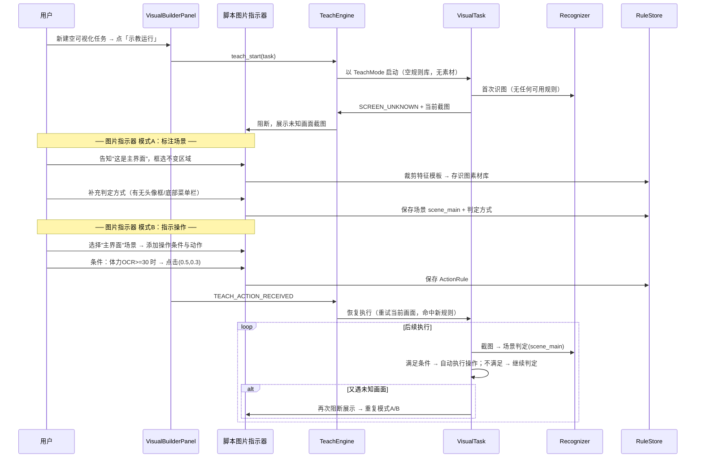

# 17-可视化构建模块（Visual Builder）方案 v0.11

> 状态：**草案**（迭代中，随用户需求逐版完善）
> 目标：在 UI 中**零代码**构建游戏任务脚本，且**不限于单一游戏**——任何可通过
> 截图+点击+OCR 控制的游戏都能接入（Game Profile 档案化）。
> 核心：示教生成素材与规则 → 节点图画布（ComfyUI 风格）编排完整逻辑 → 自动运行。
> 已确认：整合主程序（支撑度约 80%）/ 复用现有 `OcrLocator`(PaddleOCR) /
> 拖动+滚动拼接 / 场景原语判定 / 流程编排（全局检查器+主流程）/ 节点图为主形态 /
> **节点画布首选 NodeGraphQt** / **游戏无关（Game Profile）** /
> UI：执行与生成分菜单（同进程，暂缓细化），不做双窗口。

---

## 〇、架构决策：整合进现有主程序 ⭐（已确认方向）

**结论：作为主程序内部的高内聚独立模块集实现，不单独开新脚本。**

### 理由
1. **地基复用**：设备连接(adb)、识图(Recognizer)、点击执行(Executor)、防封(AntiDetect)、
   PyQt5 UI、事件总线、日志、素材库——示教/构建功能约 90% 依赖这些现成基础设施，
   独立脚本等于重写整个地基。
2. **实时闭环**：示教的本质是"执行引擎 + 交互反馈"的强耦合闭环
   （截图 → 展示 → 点击 → 生成规则 → 继续执行）。同进程内走事件总线即可低延迟交互；
   跨进程(独立脚本)需 IPC，实时性、同步、调试成本大幅上升。
3. **数据单一来源**：示教产物（素材/规则/脚本）直接写入现有素材库、
   `config/visual_tasks/`、`tasks.yaml`，无跨应用同步一致性问题。
4. **部署统一**：仍是一个 `.app` 双击即用。

### 复杂度控制（整合的关键，回答"比整个脚本还复杂"的顾虑）
- **高内聚独立子包 `visual/`**：内部再分子模块，对外只暴露少量接口。
- **事件解耦**：示教引擎 ↔ 执行器 ↔ UI 全部走 EventBus（现有机制），模块间不直接调用。
- **可选加载**：不进入可视化构建时该模块零占用（惰性 import / 注册）。
- **新能力独立成件**：OCR、场景探测为新增子模块，渐进式加入，不阻塞现有主流程。
- **分阶段交付**：P0 骨架 → P1 示教核心 → P2 编辑增强 → P3 导出联动，每阶段可独立验证。

### 〇.1 多脚本运行与前后端分离分析（用户咨询 ⭐）

**澄清一个关键点**：UI 实例（前端窗口）确实轻量，开多个前端不增加多少消耗 ✅；
但**"多脚本并行"的消耗在后端执行层**（每个脚本 = 设备会话 + 截图 + 识图 + 点击），
这部分消耗**与前端数量无关**——多前端并不会让多脚本并行更省资源。

**多脚本并行的本质**：后端为每个并发脚本各付一份执行资源。
一个 UI 窗口即可驱动多个脚本（当前架构内实现多任务并发即可）。

**两种路线（正交，可独立决策）**：

| 路线 | 做法 | 收益 | 代价 |
|---|---|---|---|
| **A. 进程内多任务并发（推荐当前）** | 扩展 `RunController`：每个脚本独立执行线程/状态/会话，一个 UI 驱动 N 脚本 | 满足多脚本需求；实现可控 | 需要处理多任务并发（设备独占/排队、状态隔离） |
| **B. 前后端分离（未来演进）** | 后端进程常驻（设备+执行+示教引擎），前端 UI 经本机 IPC（socket/websocket）连接 | UI 崩溃不影响脚本继续跑；可多端/远程查看同一后端 | **示教实时交互必须 IPC 化**（截图↔点击↔规则跨进程）、状态同步/编辑冲突、协议与序列化、开发量大增 |

**结论**：
- 多脚本需求**不需要**前后端分离——用路线 A（多任务并发）即可，性能只取决于脚本数。
- 前后端分离（路线 B）的真实价值是"**UI 稳定性隔离 + 多端观察**"，不是性能；
  若未来需要再演进，此时示教引擎需随之后端化（本机 IPC 延迟 ms 级可接受，但复杂度显著）。

**追问："运行 UI"与"绘制 UI"分开，需要前后端分离么？——不需要。**

"UI 分开"（表现层）≠"前后端分离"（进程/部署层）。三种形态：

| 形态 | 说明 | 是否满足"分开"体验 | 成本 |
|---|---|---|---|
| **A. 同进程双窗口（推荐）** | 一个应用两个独立窗口：**运行窗口**（控制/状态/日志）+ **绘制窗口**（节点画布/示教控制台），共享同一后端 | ✅ 绘制时全屏画布，运行时切运行窗口；关闭绘制窗口不影响运行 | 低（同一进程，窗口独立即可） |
| B. 同进程单窗双视图 | Tab/分屏切换运行视图与绘制视图 | 部分（不够"独立窗口"感） | 最低 |
| C. 两进程（真·前后端） | 运行器进程 + 绘制器进程，IPC 通信 | ✅ 进程级隔离（一端崩不影响另一端） | 高：**示教交互必须跨进程**（截图↔点击↔规则）、状态同步、协议 |

**为什么建议 A（同进程双窗口）**：
- **示教是强耦合点**：示教控制台（绘制 UI 的一部分）必须与运行引擎**实时协同**——
  截图 → 展示 → 你点击 → 生成规则 → 立即继续执行。同进程零延迟、零 IPC。
- A 形态已完整满足"绘制界面与运行界面分开"的体验诉求；
- 只有当你还要"**进程级隔离**"（绘制界面崩溃/关闭绝不影响运行）或"**跨设备查看运行状态**"时，才需要升级到 C（届时示教引擎随之后端化）。

---

## 一、目标与理念

### 1.1 核心诉求
1. 提供**独立的可视化构建入口**（主窗口新增菜单/面板），负责任务的新建、构建、测试全部流程。
2. 可视化任务可**单独启动**（不依赖全局调度），边运行边示教。
3. 脚本识图遇到**不认识的画面**时：**截图显示到构建面板 → 阻断执行**。
4. 用户**在截图上点击指示**应点击哪里 → 系统**记住该画面 → 动作**规则。
5. 最终用户**不写一行代码**即可产出可运行的任务脚本。

### 1.2 设计理念
- **示教式编程（Programming by Demonstration）**：不要求用户理解步骤图/代码，
  而是"跑一次、点一下、记住"。
- **数据驱动**：可视化任务 = JSON/YAML 定义（步骤 + 画面规则），与现有 .py 任务并存，
  都通过 `TaskRegistry` 注册、可被调度器调度。
- **复用现有识图能力**：画面匹配直接基于 `Recognizer` 模板匹配（`find_one`），
  不重造识图引擎。

---

## 二、核心概念与术语

| 术语 | 含义 |
|---|---|
| **可视化任务 VisualTask** | 数据驱动的任务，非 .py 代码；由「步骤」+「场景规则库」组成 |
| **场景规则 SceneRule** | `{场景特征 → 操作集}` 的示教产物；识别出场景即执行其操作集 |
| **脚本图片指示器 ScriptImageIndicator** | 示教控制台核心：展示当前未知画面截图，接收用户"这是什么场景 / 该做什么"的指示 |
| **场景特征 SceneFeature** | 用户标注的"永远不变"区域（+ 判定方式），用于识别某界面 = 某场景 |
| **场景判定 SceneJudgement** | 用户描述的识别方式（有无头像框/底部菜单栏等），与特征共同判定场景 |
| **操作规则 ActionRule** | 某场景下"n 种条件 → n 种点击/拖动"，条件可含数据判断（OCR） |
| **数据读取 DataReader(OCR)** | 查看标记位置的数据 → 识别为文字/数值（体力、剩余次数等） |
| **示教模式 Teach Mode** | 交互式运行：未知画面 → 阻断 + 上报截图，等用户指示 |
| **自动模式 Auto Mode** | 正常运行：识别场景自动执行操作；未知画面按策略处理 |
| **逻辑名 Logical Name** | 操作的可选标识（如 `btn.start`），可联动现有 `images` 映射 |
| **流程节点 Node** | 逻辑编排基本单元：场景/条件/动作/循环/跳转/结束 |
| **任务变量 Variable** | 任务级上下文（当前目标、计数、体力值等），供条件引用 |
| **条件 Condition** | 逻辑判断（OCR 数值比较 / 场景存在 / 变量比较 / 布尔组合） |
| **状态机 StateMachine** | 流程编排的运行形态：当前状态 + 条件转移 → 下一状态/动作 |
| **节点图工作流 NodeGraph** | ComfyUI 风格的可视化流程：画布上部署节点（识图器/操作器/分支…）并连线，连线即逻辑 |
| **节点 Node / 端口 Port / 连线 Edge** | 节点=功能单元（有输入/输出端口+参数面板）；连线=控制流/数据流 |

---

## 三、总体架构

### 3.1 模块清单

**🆕 新增模块**

| 模块 | 路径 | 职责 |
|---|---|---|
| 可视化数据结构 | `visual/visual_schema.py` | VisualTask / Step / ScreenRule 定义 + 序列化 |
| 可视化任务运行时 | `visual/visual_task.py` | 实现 `BaseTask` 接口，数据驱动执行 |
| 规则库存储 | `visual/rule_store.py` | 规则 CRUD + 持久化到 `config/visual_tasks/{name}.json` |
| 示教引擎 | `visual/teach_engine.py` | 未知画面检测 → 阻断 → 收用户指示 → 恢复 |
| 场景探测 | `visual/scene_probe.py` | 基于"场景特征 + 判定方式"判定当前界面 = 哪个场景 |
| 数据读取(OCR) | `visual/ocr_reader.py` | 标记区域文字/数值识别（体力、剩余次数、**队伍名**等）。**选型：RapidOCR(PP-OCRv4) 离线，中文准确率对标商业识别；模型懒加载+用后释放，低内存** |
| 画面匹配器 | `visual/screen_matcher.py` | 封装 `Recognizer.find_one`，规则命中判断 + 特征管理 |
| 滚动拼接 | `visual/stitcher.py` | 长界面滚动截图 → 重叠对齐拼接为完整全景图 |
| 可视化构建面板 | `ui/visual_builder/visual_builder_panel.py` | 主面板（任务列表 + 规则编辑 + 运行控制） |
| 示教控制台 | `ui/visual_builder/teach_console.py` | 截图显示 + 点击捕获 + 动作编辑 |
| 截图画布 | `ui/visual_builder/screen_canvas.py` | 显示截图、接收点击、标注已记录点击点 |
| UI↔核心桥 | `ui/param_bridge/visual_bridge.py` | 面板 → 示教引擎 / 规则库 / 运行的桥 |

**🔧 改动现有模块**

| 模块 | 改动 |
|---|---|
| `tasks/registry.py` | 支持注册/发现**可视化任务**（按 `config/visual_tasks/` 目录扫描，构造 `VisualTask`） |
| `core/run_controller.py` | 支持**单任务示教启动**；执行中收到阻断事件时暂停该任务（类似 per-task 中断机制） |
| `core/events.py` + `core/event_bus.py` | 新增事件：`SCREEN_UNKNOWN`（未知画面+截图）、`TEACH_ACTION_RECEIVED`（用户指示）、`TEACH_BLOCKED/RESUMED` |
| `core/recognizer.py` | 暴露"**未匹配**"时的原始截图/候选特征（供规则生成） |
| `ui/main_window.py` | 菜单树新增「可视化构建」入口 + 面板注册到中央 QStackedWidget |
| `ui/theme.py` | 面板样式/图标复用（无需大改） |
| `config/` | 新增 `config/visual_tasks/` 目录；`tasks.yaml` 支持引用可视化任务 |

---

## 四、数据模型（草案）

### 4.1 可视化任务
```jsonc
// config/visual_tasks/my_visual_task.json
{
  "name": "my_visual_task",          // 任务名（= 注册 ID）
  "display_name": "演示任务",
  "category": "daily",               // daily/permanent/event/special
  "version": 1,
  "settings": {
    "match_threshold": 0.85,          // 画面匹配阈值
    "coordinate_mode": "relative",    // relative(0~1) / absolute(px)
    "unknown_policy": "block"         // auto 模式遇未知画面：block/skip/fail
  },
  "steps": [                         // 有序步骤（可选；线性为主，后期支持分支）
    { "id": "s1", "type": "wait_screen", "rule_ref": "r1", "comment": "等待主界面" },
    { "id": "s2", "type": "goto_rule", "rule_ref": "r2", "comment": "处理主界面" }
  ],
  "rules": [ ... ]                   // 画面规则库（见 4.2）
}
```

### 4.2 画面规则 ScreenRule
```jsonc
{
  "id": "r1",
  "match": {
    "template": "assets/visual/my_task/main_menu.png",  // 画面特征：模板图（截图裁剪或素材库选图）
    "region": [0, 0, 1080, 1920],                       // 可选：限定匹配区域
    "threshold": 0.85                                    // 可选：覆盖全局阈值
  },
  "action": {
    "type": "click",                 // click / wait / goto / check / skip
    "position": [0.5, 0.3],          // 用户点击点（相对坐标，适配分辨率）
    "logical_name": "btn.start",     // 可选：逻辑名（联动 images 映射 / 后续步骤引用）
    "then": "r2"                     // 可选：执行后跳转/等待的规则
  },
  "comment": "主界面：点击开始按钮",
  "created_at": "2026-08-13T10:00:00"
}
```

### 4.3 场景 Scene（识别出的界面）
> 判定项**不是固定清单**：每个场景在示教时自由组合需要的「判定原语」（见 4.9），
> 如主界面 = 头像框 + 底部菜单；战斗界面 = 行动条 / 战斗通用装饰。

```jsonc
{
  "id": "scene_main",
  "name": "主界面",
  "judgements": [              // 判定项 = 可组合的原语集合（每场景自定义，非固定）
    {"id": "j1", "primitive": "template", "region": [0, 60, 260, 120],      // 左上角头像框
     "template": "assets/visual/xxx/avatar_frame.png", "threshold": 0.85},
    {"id": "j2", "primitive": "template", "region": [0, 1700, 1080, 220],   // 底部菜单栏
     "template": "assets/visual/xxx/bottom_menu.png"},
    {"id": "j3", "primitive": "ocr_contains", "region": [120, 100, 500, 60],
     "texts": ["庭院", "探索"]}
  ],
  "logic": "and"               // and=全部满足 / or=任一满足（可扩展组合）
}
// 战斗界面示例（用户举例：行动条 / 战斗通用装饰）
{
  "id": "scene_battle",
  "name": "战斗界面",
  "judgements": [
    {"id": "j1", "primitive": "template", "region": [..],
     "template": "assets/visual/xxx/action_bar_head.png"},   // 行动条
    {"id": "j2", "primitive": "edge_line", "region": [..]}
  ],
  "logic": "and"
}
```

### 4.4 操作规则 ActionRule（场景下"条件 → 操作"）
```jsonc
{
  "id": "a1",
  "scene": "scene_main",
  "conditions": [                        // 全部满足才执行（可空=无条件）
    {"type": "ocr_value", "region": [..], "op": ">=", "value": 30, "label": "体力"},
    {"type": "rule_exists", "rule": "r_battle_btn"}
  ],
  "actions": [
    {"type": "click", "position": [0.5, 0.3], "logical_name": "btn.battle"},
    {"type": "drag", "from": [0.9, 0.5], "to": [0.5, 0.5]}
  ]
}
```

### 4.5 动作类型（初期）
| type | 行为 | 是否需坐标 |
|---|---|---|
| `click` | 在记录点点击 | ✅ |
| `drag` | 模拟滑动（from→to / 方向+距离），用于长界面滚动 | ✅ |
| `scroll_capture` | 滚动截取多屏 → 拼接全景，供后续标注/操作 | 半（方向/步数） |
| `wait` | 等待固定秒数 | ❌ |
| `skip` | 跳过该画面（记入忽略列表） | ❌ |
| `goto` | 跳转到另一规则/步骤（实现简单分支） | ❌ |
| `check` | 仅确认画面存在（用于前置等待） | ❌ |

### 4.6 拖动手势参数
```jsonc
// relative 模式：起点 → 终点（相对坐标 0~1）
{
  "type": "drag",
  "mode": "relative",
  "from": [0.5, 0.7], "to": [0.5, 0.3],
  "duration_ms": 600,     // 滑动时长
  "steps": 20              // 插值步数（平滑，配合 AntiDetect）
}
// 方向模式：direction=up/down/left/right + distance(相对屏高/宽比例)
{"type": "drag", "mode": "direction", "direction": "up", "distance": 0.6}
```

### 4.7 长界面滚动拼接（Panorama）
当界面又长又高、一屏显示不全时，用户指示"此界面需要滚动查看"，
脚本自动滚动截取多屏（带重叠量）→ 拼接为完整全景图后供标注/操作。

```jsonc
{
  "id": "scene_list",
  "scrollable": true,             // 该场景界面超屏、可滚动
  "scroll_axis": "vertical",     // 滚动轴 vertical/horizontal
  "overlap_ratio": 0.25,          // 相邻截图重叠量（拼接对齐用）
  "stitch": {
    "captured": 3,                // 已捕获屏数
    "image": "assets/visual/xxx/list_full.png",  // 拼接后的全景图（入素材库）
    "screen_size": [1080, 1920],  // 单屏尺寸
    "total_size": [1080, 3840]    // 全景图尺寸
  }
}
```

**滚动拼接流程**：
1. 图片指示器选择「滚动捕获」→ 指示方向（如向下）与步数。
2. 引擎每屏截图 → 按方向 `drag` 滑动（重叠 25%）→ 截下一屏，循环 N 次。
3. `Stitcher` 基于重叠区域做对齐拼接（先像素差最小化，必要时特征匹配）→ 全景图。
4. 全景图入库（`assets/visual/{task}/`）并在指示器显示 → 用户在其上标注特征/操作。
5. 运行期再次进入该场景：先滚动捕获 → 判定已拼接场景 → 按全景坐标执行操作（坐标按屏映射）。
6. **拼接质量低/失败 → 提示重录**（已确认接受该反馈机制）。

### 4.8 OCR 与内存策略（用户已确认：体积不限，运行时低内存）

- **选型**：RapidOCR + **PP-OCRv4 完整版**（与 mobile 版内存占用差距不大，优先准确率）。
- **模型懒加载（Lazy Singleton）**：仅当某条操作规则的 `conditions` 含 OCR 判断时才加载模型；
  纯模板匹配的任务全程不加载 OCR，零内存开销。
- **用后释放**：一次 OCR 批量识别完成后，模型句柄可释放（下次使用重新加载）；
  或保留为"空闲超时自动回收"（默认如 60s 无 OCR 调用 → 释放，可配置）。
- **单帧处理**：识别时按区域裁剪小图送入模型，不缓存整屏大图，降低常驻内存。
- **数据流**：
  `conditions[{type:ocr_value, region, op, value, label}]`
  → `ocr_reader.read(region截图)` → `{text, value}` → 比较 → 动作执行。

### 4.9 判定原语 Judgement Primitives（可扩展，非固定清单）

场景判定项**不是固定下拉清单**：每个场景示教时自由组合需要的「判定原语」。
原语 = 带参数的原子判定；通过**注册表**可扩展（新增原语即新增能力，无需改引擎）。

| 原语 | 参数 | 典型用途 |
|---|---|---|
| `template` | region + template 图 + threshold | 框选不变区域（头像框/底部菜单/装饰） |
| `ocr_contains` | region + texts | 区域 OCR 文字包含关键词（"庭院""探索"） |
| `color_block` | region + color + tolerance | 区域主色/色块（深色菜单条等） |
| `edge_line` | region + orientation | 区域存在线条/边界（战斗行动条） |
| `...扩展` | 注册表新增 | 自定义原语（如按钮高亮、动态元素） |

- 判定组合：`logic: and / or`（初版 and，可扩展 or 组 / 权重）。
- 场景命中 = 按 logic 组合各原语判定结果；由 `SceneProbe` 执行。
- 运行期逐原语判定：先快后慢（先 template/color 等廉价原语，再 OCR 等较重原语）。

### 4.10 流程编排（可视化逻辑，核心能力）

> 目标：在构建界面表达**脚本的全部判断与运行逻辑**——
> 不只是"画面→动作"，还要支持条件分支、循环、变量、结束/返回等。

**运行形态 = 状态机**：任务处于某状态 → 依据条件转移 → 执行动作 / 进入下一状态。

```jsonc
{
  "variables": {                 // 任务级变量（初始值）
    "current_target": null,      // 当前目标
    "fought_count": 0,           // 已打次数
    "refresh_count": 0,          // 刷新次数
    "stamina": 0,                // 体力（OCR 读取写入）
    "high_value_left": true      // 是否还有高价值目标
  },
  "states": [                    // 状态 + 转移（可视化：节点 + 连线）
    {
      "id": "s_main",
      "name": "主界面",
      "transitions": [
        {"when": {"stamina", "<", 30}, "then": "s_end", "action": "back_to_main"},
        {"when": true, "then": "s_pick", "action": "click_pick"}
      ]
    },
    {
      "id": "s_pick", "name": "选择作战",
      "transitions": [
        {"when": {"high_value_left", "==", true}, "then": "s_battle", "action": "click_best_target"},
        {"when": {"refresh_count", "<", 3}, "then": "s_pick", "action": "refresh_list"},  // 刷新
        {"when": true, "then": "s_scroll", "action": "scroll_capture"}                        // 拖动寻找
      ]
    },
    {
      "id": "s_scroll", "name": "寻找战斗",
      "transitions": [
        {"when": {"scene", "==", "battle_found"}, "then": "s_pick"},
        {"when": {"scroll_end", "==", true}, "then": "s_end", "action": "back_to_main"}
      ]
    },
    {"id": "s_battle", "name": "战斗中", "transitions": [ /* 胜利/失败分支 */ ]},
    {"id": "s_end", "name": "结束", "action": "end_task"}
  ]
}
```

**节点类型（可视化面板上的节点）**：

| 节点 | 说明 | 示例 |
|---|---|---|
| `场景` | 等待/确认某场景出现 | "等待主界面" |
| `条件` | 决策分支（OCR/场景/变量/组合） | "体力<30?" |
| `动作` | 点击/拖动/刷新/滚动捕获/返回/结束 | "点击高价值作战" |
| `循环` | 重复：直到条件 / 固定次数 | "拖动直到找到战斗" |
| `跳转/结束` | 流程出口、标签 | "结束任务返回主菜单" |

**条件类型（初版）**：
- `ocr_value`：区域 OCR 数值比较（体力>=30、剩余次数）
- `ocr_text`：区域文字匹配（"战斗失败""体力不足"）
- `scene`：当前场景判定（== 某场景）
- `rule_exists`：某规则/元素存在
- `variable`：变量与常量/变量比较（fought_count>=10、scroll_end）
- `bool`：AND/OR/NOT 组合

**变量赋值动作**：`set_variable`（记录目标/计数/体力/状态标志）。

### 4.11 用户场景映射 + 补充情况清单

**用户提出的 4 类逻辑 → 流程表达：**

| 用户场景 | 流程表达 |
|---|---|
| 体力不够 → 结束任务返回主菜单 | 状态[主界面]：条件 `ocr_value 体力 < 30` → 动作 `back_to_main` + `end_task` |
| 多个作战 → 依据逻辑点击哪一个 | 状态[选择作战]：条件 `目标价值排序/OCR` → 动作 `click_best_target`（可设价值规则） |
| 高价值目标打完 → 刷新 | 状态[选择作战]：条件 `high_value_left == false` → 动作 `refresh_list`（计数限制） |
| 无战斗（可能在屏外）→ 拖动寻找 | 状态[寻找战斗]：`scroll_capture` 循环 → 条件 `scene==battle_found` 跳出 / `scroll_end` 结束 |

**补充的常见情况（一并纳入能力范围）：**

| # | 情况 | 逻辑表达 |
|---|---|---|
| 1 | **战斗结果分支**（胜利/失败） | 条件 `ocr_text"胜利/失败"` → 领取奖励 / 重试 / 放弃 |
| 2 | **连续失败熔断** | 变量 `fail_streak` 累加 → 条件 `>=N` → 结束任务返回 |
| 3 | **体力策略多选** | 结束任务返回 / 等待恢复（循环等待）/ 跳过本次 → 3 条条件分支 |
| 4 | **弹窗/验证码处理** | 场景[弹窗] → 动作关闭 / 暂停等待用户 |
| 5 | **目标去重与价值排序** | 变量 `done_targets` 列表；`set_variable` + 条件筛选高价值 |
| 6 | **全打空 → 换图/结束** | 条件 `refresh_count >= N 且 无目标` → 换图 or 结束 |
| 7 | **收益控制**（背包满/收益低） | OCR 判断 → 停止 or 换目标 |
| 8 | **次数/时长上限** | 变量 `fought_count/total_time` → 条件 → 结束 |
| 9 | **导航返回**（任意场景回主菜单） | 场景[任意] → 动作 `back_to_main`（多级返回/点击返回键） |
| 10 | **网络/连接异常** | 条件 连接状态 → 等待重连 or 结束 |
| 11 | **组队协作**（等待队友/邀请） | 场景[等待] → 循环等待 → 条件 队友就绪 |
| 12 | **任务衔接**（完成后触发下一任务） | 结束动作 `trigger_task`（联动现有调度/触发机制） |
| 13 | **奖励领取**（战斗后领奖） | 场景[结算] → 条件 有奖励 → 领取 |
| 14 | **重复保护**（防重复打同一目标） | 变量记录已打 → 条件排除 |

### 4.12 逻辑组织框架：全局检查器 + 主流程状态机

用户的逻辑本身也是不定的，大体分两类，用**两层组织**承载：

**① 全局检查器 Global Checkers（＝ 特定检查触发，旁路/拦截）**
- 任意时刻都会检查的"条件 → 处理"：体力不够、道具不够、弹出"无法战斗"、验证码…
- 带**优先级**（先查紧急项）；命中后可：结束任务 / 跳转某状态 / 执行动作后继续。
- 可选"仅在某状态生效"过滤。

**② 主流程状态机 Main State Machine（＝ 固定逻辑触发）**
- 状态 + 条件转移：点击按钮 → 进入画面 → 再点击 → 弹出分支判断。
- 弹出 A → 处理 A；弹出 B → 处理 B（多条件分支天然支持）。

```jsonc
{
  "checkers": [                     // ① 全局检查器（优先级序，每轮先跑）
    {"id": "c1", "priority": 1, "conditions": {"ocr_value": ["体力", "<", 30]},
     "actions": ["back_to_main", "end_task"]},
    {"id": "c2", "priority": 2, "conditions": {"ocr_text": ["无法战斗"]},
     "actions": ["click_close", "back_to_main"]}
  ],
  "machine": { "states": [...], "variables": {...} }   // ② 主流程
}
```

**运行时关系（每轮循环）**：
1. 进入状态前 / 每次动作后 → 先按优先级跑全局检查器；
2. 命中 → 执行其处理（可打断主流程 / 跳转 / 结束）；
3. 未命中 → 执行主流程当前状态的转移。

### 4.13 编辑交互（如何在一个界面编辑这么多）

**原则：不写表达式，全部"下拉选参数 + 卡片式"，并大量复用示教记录。**

| 卡片 | 编辑方式 |
|---|---|
| **条件卡片** | 三格参数化：`[数据源: 体力/场景/变量/规则]` + `[比较符: < = > 包含]` + `[值/选项]` |
| **动作卡片** | `[点击] [坐标/逻辑名]` · `[拖动] [方向/起止]` · `[返回主菜单]` · `[结束任务]` · `[刷新]` · `[滚动捕获]` · `[设置变量]` · `[触发任务]` |
| **转移卡片** | `[条件卡片] → [去向：状态/结束/动作]`（多分支 = 多张转移卡片） |

- **示教联动**：点击点 / OCR 区域 / 场景原语都是示教时框选或点击的产物，
  编辑时**下拉直接选用**，无需手填坐标/路径。
- **面板组织（一个面板内两个子区）**：
  - 上/左区 **「⚡ 全局检查」**：检查器列表（优先级排序、可开关、条件+处理编辑）；
  - 下/右区 **「🧭 主流程」**：状态节点画布（卡片式状态机，后期拖拽连线）。
- **新增/修改入口**：示教运行时也可实时"补丁"——未知画面阻断时可直接把当前
  情况挂为检查器或新状态。

### 4.14 节点图工作流（ComfyUI 风格，主形态 ⭐）

> **流程编排以节点图画布为主形态**（对标 ComfyUI）：在画布上拖放
> 「识图器」「操作器」「分支」「循环」等节点，连线即逻辑——直观表达全部判断与运行。

**画布元素**：
- **节点**：功能单元，含输入端口、输出端口、参数面板（Widget）。
- **连线**：节点间连接。
  - **控制流连线**：执行顺序（从 `开始` 节点沿控制线执行）。
  - **数据流连线**：传递数据（截图 → 识图器 → 识别结果 → 条件/操作器）。

**节点类型（初版，映射用户需求）**：

| 类别 | 节点 | 输入 → 输出 | 说明/示例 |
|---|---|---|---|
| 感知 | **识图器 Matcher** | 截图 → 匹配结果(场景/元素/坐标/置信度) | 匹配示教生成的场景/规则 |
| 感知 | **OCR 读取器 OCRReader** | 区域 → 文本/数值 | 体力、剩余次数、队伍名 |
| 感知 | **场景判定器 SceneProbe** | 截图+场景原语 → 场景ID | 判定当前界面 |
| 感知 | **滚动捕获器 ScrollCapture** | 方向/步数 → 拼接全景 | 屏外内容查找 |
| 操作 | **点击器 Clicker** | 坐标/逻辑名 → 完成 | 点击高价值目标/按钮 |
| 操作 | **拖拽器 Dragger** | 方向/起止 → 完成 | 滑动屏幕 |
| 操作 | **刷新器 Refresher** | → 完成 | 刷新目标列表 |
| 操作 | **导航器 Navigator** | 目标 → 完成 | 返回主菜单/进入某界面 |
| 操作 | **变量设置 SetVar** | 值 → 完成 | 记录目标/计数/标志 |
| 逻辑 | **分支 Branch** | 条件 → true/false 两路 | 体力<30? 弹出A/B? 有无高价值? |
| 逻辑 | **循环 Loop** | 条件 → 子图 | 拖动直到找到战斗 / 固定次数 |
| 逻辑 | **计数器 Counter** | → 值 | 已打/刷新次数 |
| 控制 | **开始 Start / 结束 End** | 入口 / 结束任务·返回 | |
| 控制 | **检查器 Checker** | 条件 → 处理 | 全局旁路触发（体力/弹窗/道具） |

**执行模型**：
1. 从 `开始` 沿**控制流**执行；`分支` 按条件选一路；`循环` 重复子图。
2. **数据流**自动传递：识图器输出的场景/坐标供分支条件与点击器使用。
3. 全局检查器（`检查器` 节点组）挂在关键节点前，每步先检查。

**与示教联动**：
- 识图器/OCR/点击器节点的参数来自示教产物（场景原语、OCR 区域、点击点），
  画布上**下拉选用**，不手填。
- 示教运行时未知画面阻断 → 可在画布上实时补节点/连线。

**与双层模型的关系**：
- 主流程 = 画布主控制流；全局检查器 = 画布上的一组 `检查器` 节点连到关键位置。
- 两者统一为一张节点图，不再分两套编辑界面。

### 4.15 节点画布引擎选型（调研结论 ⭐）

> 调研了主流开源节点图编辑器，结合本项目 **PyQt5** 技术栈给出选型。

**✅ 首选：NodeGraphQt（`jchanvfx/NodeGraphQt`）**

- **纯 Python + Qt**（`pip install NodeGraphQt`，MIT，v0.6.44），底层 `Qt.py` 兼容层
  支持 PyQt5/PySide2/PySide6 —— 与本项目 PyQt5 直接契合。
- **能力完整**（对标 ComfyUI 交互）：
  - 画布/节点/端口/连线，拖放连线、节点插入连线、缩放平移；
  - 节点内嵌 widget（下拉/输入/数字/复选框/按钮）→ 直接承载"下拉选参数"编辑；
  - `NodesPaletteWidget` 节点面板（拖放创建节点）→ 节点库；
  - `PropertiesBin` 属性面板（双击节点编辑）；
  - undo/redo、backdrop 注释、GroupNode 分组、SubGraph 子图；
  - 会话 JSON 序列化（`save_session/load_session`）→ 直接落到 `visual_tasks/{name}.json`。

**备选：自研 QGraphicsView 轻量画布**（若 PyQt5 兼容层有小问题）
- 参考 NodeGraphQt / QtNodes 的架构：QGraphicsScene+View、节点 Item、连线 Path、端口。
- 约 2-3 周工作量，只做核心交互（拖放/连线/缩放/undo）。

**排除：paceholder/nodeeditor（QtNodes）** —— C++/CMake 编译库，不适合纯 Python 项目。

**节点类型 → 实现映射**：
| 可视化任务节点 | NodeGraphQt 实现 |
|---|---|
| 识图器/场景判定/OCR/滚动捕获 | 自定义 `BaseNode` 子类，参数用 add_combo/add_region（框选回调） |
| 点击器/拖拽器/刷新/导航/变量 | 自定义 `BaseNode`，端口连控制流 |
| 分支/循环/计数器/检查器/开始/结束 | 自定义 `BaseNode`，多输出端口表达分支 |
| 节点参数（下拉选参，复用示教产物） | `add_combo_menu` 挂示教记录；`add_custom_widget` 嵌入区域框选器 |

### 4.16 现有代码支持度评估（整合可行性验证 ⭐）

> 逐项核验现有代码，结论：**执行/感知/OCR/防封/事件/设备支撑度约 80%，
> 整合可行且显著优于分开**（分开需重写全部地基）。

**✅ 高支撑（直接复用）**：
| 能力 | 现有实现（已核验） | 可视化功能需要 |
|---|---|---|
| 识图 | `Recognizer.find_one` 模板匹配 + 素材缓存 | 场景原语 template 匹配 |
| 点击 | `Executor.click_image/click_position` | 点击器节点 |
| 拖动 | `Executor.swipe`（贝塞尔轨迹 + 防封） | 拖拽器节点 |
| 场景探测 | `Executor.detect_scene`（多候选） | 场景判定基础 |
| **OCR** | **`OcrLocator`（PaddleOCR 引擎，懒加载）已存在**；`Recognizer` 已注入
  `_ocr`；`Events.OCR_RESULT` 已定义；`tasks/common/check_stamina.py`（体力）与
  `select_team.py`（队伍名）**已预留 OCR 调用点** | 数据读取（体力/队伍名） |
| 防封 | `AntiDetect`（间隔/贝塞尔轨迹） | 点击拖动安全 |
| 事件/中断 | EventBus + per-task 中断（`cycle_limit_event` 模式已实现） | 示教阻断/恢复 |
| 设备/截图 | device 连接 + screenshot | 示教截图 |
| 任务注册 | `TaskRegistry` + `BaseTask` | VisualTask 注册 |
| UI 基础设施 | PyQt5 + 菜单树面板 + `param_bridge` + theme | 构建面板接入 |
| 配置/素材 | `config_manager` + `asset_catalog/meta` | 特征模板自动入库 |

**🆕 全新缺口（无可复用，需新建）**：
1. 示教引擎（截图阻断/交互/恢复）
2. 场景判定器（SceneProbe + 判定原语执行）
3. 滚动拼接（Stitcher）
4. 节点图画布 UI（NodeGraphQt 集成）
5. 可视化任务运行时（节点图 → 执行翻译）
6. 构建面板 UI

**🔧 需改动（低风险，additive）**：
- `run_controller`：单任务示教模式 + 阻断（复用 per-task 中断模式）；
- `events.py`：新增事件；`executor`：暴露未匹配截图（小改）；
- `main_window`：菜单项 + 面板；`registry`：可视化任务发现。

**依赖影响（整合零侵入的关键）**：
- NodeGraphQt（画布）：仅构建面板惰性加载，不影响主流程；
- OCR：现有 `OcrLocator` 已实现 PaddleOCR 懒加载，纯模板任务不加载。

**结论**：分开 = 重写设备/识图/点击/防封/OCR/事件/UI 全部地基；
整合 = 只新建"编排与交互层"（示教/节点图/拼接）。**维持整合。**

### 4.17 端到端使用流程（怎么用节点画面做出一个脚本）

> 以"自动刷探索副本"为例，走完整流程。核心循环：**示教教它认画面 → 指示它怎么做 →
> 连线成流程 → 自动跑 → 遇新画面再补**。

**阶段 0 · 新建（30 秒）**
1. 可视化构建 → 新建任务"刷探索" → 得到空画布 + 一个 `开始` 节点。
2. 点「示教运行」→ 空脚本首次识图失败 → 当前游戏截图自动显示到图片指示器。

**阶段 1 · 示教标注场景（教它"认画面"）**
> 每次遇到未认识的画面就阻断，你告诉它"这是什么界面"，并框选判定特征。

| 操作 | 你输入 | 自动生成 |
|---|---|---|
| 标注"主界面" | 场景名 + 框选头像框区域 + 框选底部菜单栏 + 勾选 ocr_contains("探索") | 特征模板裁剪入素材库 + 判定原语 |
| 标注"探索界面" | 框选"探索"按钮/困难难度切换 | 特征模板 + 原语 |
| 标注"战斗界面" | 框选行动条 + 勾选 edge_line | 特征模板 + 原语 |

→ 画布自动生成对应 `场景判定器` 节点，参数已填好（场景ID）。

**阶段 2 · 指示操作（教它"怎么做"）**
> 每个场景下，你点一下它该点的位置，或填条件动作。

| 场景 | 你输入 | 节点 |
|---|---|---|
| 主界面 | 点击"探索入口"位置 | `点击器`(逻辑名=explore_btn, 坐标=示教点) |
| 探索界面 | 点击"困难"→"开始" | 两个 `点击器` |
| 战斗界面 | 框选"胜利/失败"文字区 | `OCR读取器`(区域, 输出到变量 result) |
| 结算界面 | 点击"再次挑战"/"领取奖励" | `点击器` |

**阶段 3 · 流程编排（连线成逻辑）**
> 在画布上把节点连成流程，填分支条件。

```
[开始]
  → [⚡检查器: 体力<30] ──是──→ [结束: 返回主菜单]
  → [场景判定: 主界面] → [点击: 探索入口]
  → [场景判定: 探索界面] → [分支: 有高价值目标?]
        ├─是 → [点击: 困难] → [点击: 开始]
        └─否 → [循环: 刷新列表] → 回[分支]
  → [场景判定: 战斗界面] → [OCR: 胜负] → [分支: 胜利?]
        ├─胜 → [场景: 结算] → [点击: 再次挑战] → 回[探索界面]
        └─败 → [点击: 放弃] → [结束: 返回主菜单]
```

**阶段 4 · 自动运行**
- 点「自动运行」→ 节点图逐节点执行：场景判定→点击→OCR→分支→循环。
- 全部画面已认识 → 全程无阻断跑通。
- 遇到新画面（游戏更新/新弹窗）→ 再次阻断示教，补一个场景+操作即可。

**节点与参数速查**：

| 节点 | 需输入参数 | 参数来源 |
|---|---|---|
| 开始 / 结束 | 结束方式(结束任务/返回主菜单) | 下拉 |
| 检查器 | 条件(数据源+比较符+值) + 处理动作 | 下拉选数据源（体力/变量/场景） |
| 场景判定器 | 场景ID | 下拉选已示教场景 |
| 识图器 | 元素/规则 + 阈值 | 下拉选已示教元素 |
| OCR 读取器 | 区域 + 输出变量 | 下拉选已标注区域 / 框选 |
| 点击器 | 逻辑名 或 坐标 + 偏移 | 下拉选示教点击点 |
| 拖拽器 | 方向+距离 或 起止坐标 + 时长 | 下拉/手填 |
| 滚动捕获器 | 方向 + 步数 + 重叠量 | 手填 |
| 分支器 | 条件 + 两路输出 | 下拉组合条件 |
| 循环器 | 次数 或 直到条件 | 手填/下拉 |
| 计数器 / 变量设置 | 变量名 + 值/步长 | 手填/下拉 |
| 等待器 | 秒数 或 直到场景 | 手填 |

### 4.18 游戏无关通用性（多游戏支持 ⭐）

> 目标：这套可视化构建不只控制一个游戏，**任何可通过"截图+点击+OCR"控制的游戏**都能接入。

**分层结论：执行能力层已天然通用，需通用化的是数据/配置层。**

| 层 | 现状 | 通用化设计 |
|---|---|---|
| 执行能力（识图/点击/拖动/滚动/OCR/截图） | 纯视觉+设备交互，**本就与游戏无关** | 无需改动 |
| 节点画布 / 示教 / 场景判定 | 节点都是通用原语（画面→动作→流程） | 无需改动 |
| 素材 / 可视化任务 / 设备配置 | 目前按 yys 组织 | **引入 Game Profile（游戏档案）** |

**Game Profile（游戏档案）**：一个游戏 = 一组独立配置，可随时切换。

```
config/
  games/
    yys/
      profile.yaml          # 游戏档案：素材根/任务目录/OCR语言/设备默认/分辨率
      visual_tasks/         # 该游戏的可视化任务（含节点图 json）
        my_task.json
    other_game/
      profile.yaml
      visual_tasks/...
assets/
  yys/...                    # 各游戏素材按 profile 隔离
  other_game/...
```

**Profile 内容**：`game_id`、显示名、素材根、任务目录、OCR 语言（ch/en…）、
坐标模式（相对/绝对）、默认设备参数。

**切换机制**：主界面顶部"当前游戏"选择 → 切换素材库 + 可视化任务集 + 设备参数。
可视化任务自带 `game_id`，调度器/执行器按档案加载。

**共享资产**：通用检查器模板（体力不足/弹窗/验证码处理逻辑）可跨游戏复用；
节点画布、节点库、示教、滚动拼接、OCR 全部与游戏无关。

### 4.19 节点画布编辑器详细设计 ⭐

**节点定义（元数据驱动，新增节点=新增一个 dict）**：
```jsonc
{
  "type": "clicker", "label": "点击器", "category": "操作",
  "inputs": [{"name": "in", "port_type": "control"}],
  "outputs": [{"name": "out", "port_type": "control"}],
  "params": [
    {"name": "target", "label": "点击目标", "widget": "combo_teach_point"},
    {"name": "offset", "label": "偏移", "widget": "spinbox", "default": 0}
  ]
}
```

**端口类型**：`control`（控制流=执行顺序）；数据流类型化：`image` / `text` / `value` /
`scene` / `point`（连线时校验端口类型兼容）。

**参数 Widget 类型（不写代码编辑）**：
| widget | 用途 |
|---|---|
| `combo_teach_point` | 示教点击点下拉 |
| `combo_scene` / `combo_element` | 已示教场景/元素下拉 |
| `combo_ocr_region` | 已标注 OCR 区域下拉 |
| `region_pick` | 在截图/全景图上框选区域 |
| `combo_condition` | 条件组合（数据源+比较符+值） |
| `spinbox` / `text` / `checkbox` | 数值/文本/开关 |

**图执行器（从图到执行）**：
1. 从 `开始` 沿 `control` 输出执行；节点执行完沿 out 继续。
2. `分支` 节点：按条件选一路；`循环`：重复子图（次数/直到条件）。
3. **数据流**：上游节点输出（截图/识别结果/变量）自动传给下游节点输入。
4. 执行上下文：当前截图、任务变量、场景缓存、示教阻断信号。
5. 状态机：运行 / 暂停 / 停止 / 示教阻断（复用 per-task 中断模式）。

**序列化**：节点图（节点+连线+位置+参数）↔ JSON，存 `visual_tasks/{game}/{task}.json`；
NodeGraphQt `save_session` 可承载节点/位置，任务语义另行入参。

**画布交互（NodeGraphQt 提供）**：拖放节点、端口连线、节点插入连线、缩放平移、
undo/redo、backdrop 注释、节点禁用、分组。

### 4.20 当前代码耦合度评估 + Game Profile 化改造路径 ⭐

> 回答"现在是不是干净骨架 / 加游戏删游戏无残留能否实现"。

**结论：执行能力层通用 ✅，但当前整体**不是**干净骨架 —— 数据/内容层深度耦合阴阳师。
目标形态（加文件夹=加游戏、删文件夹=无残留）完全可实现，路径见下。**

**现有耦合点（已核验，分为三大块，均属"yys 战斗/组队玩法"领域）**：

**块① 战斗配置**（TaskConfig 全局字段 + 战斗任务体系）：
- `TaskConfig`：`soul_setup`(御魂)/`lock_team`/`change_team`/`stamina_required`/`team_id`
- `task_template`：`battle` 任务类型；`ui`：`uses_battle`、战斗配置 Tab、战斗任务类型
- `run_state`：`battling` 状态；`main_window`：battling 状态显示

**块② 组队协作体系**（独立于战斗配置，横跨多层）：
- `account_manager`：`get_teaming_partners`/`prepare_teaming`/`coordinate_action`、
  `team_group`/`teaming_enabled`、组队动作枚举（ACCEPT_INVITE/PREPARE_JOIN）
- `events.TEAMING_PREPARED`；`config_schema.teaming(sub_ids)`；`run_controller/scheduler` 透传
- `ui/widgets/team_editor.py`（队伍编辑器）、组队小号多选面板

**块③ 战斗执行步骤**（tasks/common/，偏任务层）：
- `battle_loop.py`/`check_stamina.py`/`select_team.py`/`pre_check_team.py` 等

**确实干净的骨架（核心基础设施）**：
- `core`：executor/recognizer/ocr_locator/anti_detect/scheduler 核心/event_bus/state_manager/
  monitor/logger/run_controller 核心/run_state(除状态枚举)/config_manager(除字段)/bootstrap
- `device`：全部（adb/连接/截图/心跳/模拟器）——纯通用
- `ui`：main_window 框架/日志/设置/队列/素材管理/menu_tree——纯通用

**目标形态实现路径（Game Profile 化）**：
1. **目录隔离**：`config/games/{game}/` + `assets/{game}/`（profile.yaml + visual_tasks + 任务集）。
2. **UI 菜单动态化**：`MenuTree` 增加"游戏"级——**扫描 `config/games/` 动态生成菜单**：
   加文件夹 → 菜单自动出现；删文件夹 → 菜单消失（骨架零硬编码游戏内容）。
3. **加载器按 profile**：`GameProfile` 加载器按当前游戏解析素材/任务/配置；
   切换游戏 → 重载对应集合。
4. **现有 yys 内容迁移**：tasks/yys 任务、素材、tasks.yaml 迁入 `games/yys/`（迁移后运行行为不变）；
   删 `games/yys/` = 该游戏任务/素材/菜单全部消失，骨架无残留。

**诚实的难点与建议**：
- `TaskConfig` 的 yys 战斗字段（御魂/组队/体力）若严格"骨架干净"，应**迁移到 game schema**
  （yys 专属配置不进全局）；但这是**侵入性重构**，会影响现有 40+ 个 yys 任务。
  **建议分期**：P0/P1 先做"目录隔离 + 动态菜单 + 可视化任务 Game Profile"（新体系天然干净），
  现有 yys 代码任务保持兼容运行；P3+ 再按需把 yys 字段抽象到 game schema。
- 可视化构建（新体系）**从一开始就按 Game Profile 实现**，天然达到"无残留骨架"。

### 4.21 通用核心 vs 游戏专属：最终边界清单（Game Profile 化落地依据）

> 已确认设计意图：**战斗/组队模块本就是 yys 专属，不计入核心**。
> 任意新游戏（如明日方舟）只需通用核心 + 自己的游戏内容。

**✅ 通用核心（所有游戏共享，纯骨架）**：
| 模块 | 能力 |
|---|---|
| device/ | adb 连接/截图/心跳/模拟器 |
| core/executor + recognizer + ocr_locator | **点击/拖动/识图/OCR 判断**（纯视觉+设备） |
| core/scheduler | **任务栈/调度**（到期/触发/冷却/熔断/失效区） |
| core/event_bus + events(通用部分) | 事件通信 |
| core/run_controller 核心 | 任务执行/队列/状态 |
| core/state_manager + monitor + logger | 状态/日志 |
| core/config_manager | 配置管理 |
| core/anti_detect | 防封（间隔/轨迹） |
| ui/（框架/日志/设置/队列/素材/菜单） | UI 基础设施 |
| **visual/（新）** | 可视化构建（节点图/示教/场景判定/滚动拼接/OCR 读取） |

**🎮 游戏专属（yys 有、明日方舟等不需要）**：
| 模块 | 归属 |
|---|---|
| 战斗体系（soul_setup/lock_team/change_team/stamina_required、battle 任务类型、uses_battle、战斗配置 Tab、battling 状态、battle_loop/check_stamina/select_team） | yys 专属 |
| 组队体系（teaming/sub_ids/team_group/teaming_enabled、TEAMING_PREPARED、队伍编辑器、组队小号面板、coordinate_action） | yys 专属 |
| yys 任务代码（tasks/*.py）、素材（assets/）、坐标（coords/） | yys 专属 |

**明日方舟接入示例**：加 `config/games/arknights/` + `assets/arknights/` → 用可视化构建器
示教生成方舟任务 → 节点图画布编排 → 调度运行。**战斗/组队体系完全不加载**。

**边界原则**：核心骨架**零游戏内容**；一切游戏内容按 `games/{game}/` 隔离；
`TaskConfig` 的 yys 字段（战斗/组队）后续迁到 yys game schema（P3+，兼容运行）。

### 4.22 布局定位与任务参数化（战斗配置可视化 ⭐）

> 用户洞察：**战斗配置本质上也是游戏任务**——需要游戏图片、按输入参数在图中找特定位置。
> 应能在节点画布上构建，并把需要输入的属性（九宫格(1,1)、一排第4个、2×N第2排第1个）暴露为参数。

**核心：布局定位节点（Layout Locator）+ 任务参数化**，二者都是**跨游戏通用**能力。

**① 布局定位节点（网格/列表/九宫格）**
```jsonc
// 布局定义（示教生成：点锚点/点第1格第2格推断方向间距；输入行列数）
{
  "id": "layout_battle_grid", "type": "grid",       // grid / list_h / list_v / grid_list
  "anchor": [0.1, 0.2],       // 锚点（相对坐标）
  "rows": 3, "cols": 3,       // 行列数（九宫格=3x3）
  "gap_x": 0.1, "gap_y": 0.1, // 间距（相对）
  "cell_size": [0.05, 0.05]
}
```
节点流：`[布局定义] → [定位: 参数 行/列/序号] → [坐标] → [点击器]`
- `定位` 节点参数：行/列/序号（可来自变量：`current_row`/`target_index`）
- `格子内容` 节点：定位到格子 → **OCR 读取该格内容** → 判断价值/类型
  （实现"九宫格里找高价值目标"：逐格 OCR → 分支点哪格）

| 布局类型 | 参数 | 例子 |
|---|---|---|
| `grid` 九宫格/网格 | 行列数 + 锚点 + 间距 + (行,列) | 3×3 九宫格 (1,1) |
| `list_h`/`list_v` 横/竖排 | 数量 + 锚点 + 步距 + 序号 | 一排战斗第4个 |
| `grid_list` 多行列表 | 每行数量 + 行数 + (行,列) | 2×N 第2排第1个 |

**② 任务参数化（VisualTask 声明输入）**
```jsonc
// 战斗配置 = 一个参数化的可视化子任务
{ "name": "battle_config", "inputs": [
    {"name": "target_pos", "type": "grid_pos", "default": [1, 1]},
    {"name": "team", "type": "text", "default": "默认"}
]}
// 主流程调用子任务并传参：
[调用节点: battle_config] 参数 target_pos=[2,1] team="主力"
```

**③ 战斗配置 = 参数化可视化任务（升华）**：
- 选目标逻辑 = `布局定义 + 定位 + 格子OCR判断 + 点击器`（**全部通用节点**）
- 输入属性 = 任务声明的 `inputs`（布局位置/队伍/难度）
- 收益：战斗配置不再依赖 yys 硬编码字段（soul_setup/teaming），而是**通用节点参数化表达**，
  **跨游戏可用**（明日方舟的选怪/选格同样适用）

### 4.23 动态实例识别 + 状态记忆（九宫格打怪这类复杂逻辑 ⭐）

> 场景：画面 9 个一模一样的怪，先打第 N 个；打赢→怪消失剩 8 个；打输→还是 9 个
> 但这个怪**不能再打**（需记忆排除）。问：识图与节点画布能否表达？

**能实现，拆为三层：多实例识别 → 状态记忆 → 选择循环。**

**① 多实例识别（新能力 FindAll）**
现有 `Recognizer.find_one` 是单目标；需要**多实例检测**（模板匹配多峰值）：
```
[FindAll: 怪模板] → 输出匹配列表 [{x,y,w,h,conf} × N]   // 9 个
```

**② 状态记忆（列表变量）**
- 变量支持**列表/集合**：`done_cells`（已打/不能再打的格子）、`empty_cells`（消失的空位）
- 每次识别后：`ListFilter` 排除 `done_cells` + 空位 → 剩余候选

**③ 选择循环（节点图完整表达）**
```
[开始]
  → [FindAll: 怪模板] → 9 位置
  → [ListFilter: 排除 done_cells + 空位] → 候选列表
  → [分支: 候选为空?]
       ├─是 → [结束: 全部打完 / 体力不足]
       └─否 → [ListNth: 取第 current_index 个] → 当前怪坐标
  → [点击: 该怪] → [进战斗] → [OCR: 胜负]
       ├─胜 → [ListAppend done_cells: 该格] → 回 [识别]（画面剩 8）
       └─败 → [ListAppend done_cells: 该格]（标记不能再打）→ 回 [识别]
```

**新增节点/能力（跨游戏通用）**：
| 节点 | 作用 |
|---|---|
| `FindAll` 多实例识别 | 模板匹配多目标 → 位置列表 |
| `ListFilter` | 排除 done/空位列表 |
| `ListNth` / `ListAppend` / `ListDiff` / `ListLen` | 取第N/追加/两帧差集(打赢消失)/数量 |
| `ListIter` + `循环` | 遍历候选（逐个打） |
| 变量类型：`list` | 存 done_cells/empty_cells |

**诚实说明**：这属于节点系统的**高级能力**（多实例识别 + 列表数据流 + 迭代循环），
归入 P2/P3 节点库扩展；依赖"数据流支持列表"（决策 17 → 需确认列表变量）。

### 4.24 骨架 vs 脚本数据：边界原则（防耦合的关键 ⭐）

> 用户担忧：把"九宫格打怪"这类属性记入脚本，不就让骨架耦合游戏内容了么？

**不耦合——关键在于区分"能力类型（骨架）"与"参数值（脚本数据）"：**

| | 是什么 | 含游戏内容? | 存哪里 |
|---|---|---|---|
| **骨架**（核心引擎） | 节点**类型**：`FindAll`（多实例识别能力）、`ListFilter`（列表过滤）、`点击器`、`布局定位器`… | ❌ 完全不含（`FindAll` 不知道"怪"是什么，它只做"找多个匹配位置"） | 核心代码 |
| **脚本**（可视化任务） | 节点**实例的参数值**：`FindAll: 怪模板.png`、`done_cells`、`九宫格锚点`… | ✅ 本就是游戏数据 | `config/games/{game}/visual_tasks/` |

**举例**：
- 骨架 = `FindAll` 节点**类型** + 能执行它的引擎 + 画布 —— 通用，零游戏内容 ✅
- 脚本 = "用 `FindAll` 找`怪模板`"、"`done_cells` 列表"、"九宫格布局定义" —— 这些是**该游戏的 json 数据**，存游戏文件夹 ✅

**边界原则（设计红线）**：
1. **节点类型库只含通用原语**：FindAll / 列表运算 / 布局定位 / 点击 / OCR / 分支 / 循环…
   绝不允许出现"怪/御魂/探索"等**游戏命名**的节点类型。
2. **游戏内容只存在于节点参数值（数据）**：模板图片、布局锚点、关键词 —— 全是脚本数据。
3. **删游戏 = 删 `games/{game}/` 数据文件夹 = 骨架无残留**（骨架从不持有任何游戏数据）。

**类比**：骨架 = 计算器（提供加法能力）；脚本 = 你输入的数字公式（你的数据文件）。
计算器不会因为算过 1+1 就"耦合"了数字 1 —— 数字是数据，不是计算器的一部分。

### 4.25 任务形态原则：可视化唯一 + 自定义节点扩展点

> 用户确认：新体系下**每个游戏任务都应可视化生成**，理论上不存在非可视化任务。

- ✅ **所有任务 = 可视化节点图**（`games/{game}/visual_tasks/`），这是唯一任务形态。
- **自定义节点（Code/Custom Node）作为扩展点**：当可视化难以表达复杂逻辑时
  （组队协调 / 多账号协作 / 特殊算法），可写一个自定义节点注册进**节点库**，**在画布上照样用**——
  任务仍是节点图，只是某个节点的底层由代码实现。保持"骨架提供能力、脚本提供内容"。
- **存量代码任务**（现有 `tasks/*.py`）= 过渡资产：迁移到 `games/yys/tasks/` 保持运行，
  可逐步用可视化重建后删除；长期主形态为 `visual_tasks/` + 自定义节点。
- 说明：早期"战斗仍走代码任务"的旧决策已被 4.22 升华取代——战斗配置也是可视化参数化任务。

### 4.26 通用操作 Operation（可复用子图 ⭐）

> 用户需求：游戏任务全部走节点；有一部分"游戏任务通用的部分"（用户称**通用操作**）——
> 如战斗前配置阵容、调整御魂、画面无法操作时重启游戏——希望可视化节点有能力**生成这些通用操作**，
> 并且**通用操作也能作为节点加入其他游戏任务的步骤中**。

**概念统一：可复用、参数化的子图 = 操作（Operation）**

| 层级 | 例子 | 存哪 |
|---|---|---|
| **跨游戏通用操作** | 重启游戏、关闭通用弹窗、返回主界面、画面卡死处理 | `games/_shared/operations/` |
| **游戏内共享操作** | yys：战斗前配置阵容、调整御魂、选择队伍 | `games/yys/operations/` |
| **参数化子任务**（4.22） | 战斗配置（选目标：布局定位+OCR+点击） | `games/yys/visual_tasks/` 或 operations |

**机制（三个要素）**：
1. **操作定义** = 一个**子图**（一组节点 + 输入参数 + 输出），可单独编辑/测试。
2. **操作调用节点**：任务节点图中放一个"操作节点" → 填参数 → 展开/内联执行子图。
3. **操作库分类**：`_shared`（跨游戏）/ `{game}`（游戏内）；操作可**嵌套**引用其他操作。

```
// 操作定义（子图）：games/yys/operations/configure_team.json
{ "name": "configure_team",
  "inputs": [{"name": "team", "type": "text"}],
  "graph": [ /* 识图找阵容界面 → 布局定位 → 点击选择 → 确认 */ ] }

// 任务节点图中引用：
[操作节点: configure_team]  参数 team="主力"
```

**分层结构（任务 = 主图 + 引用操作）**：
```
游戏任务 visual_tasks/xxx.json（主流程节点图）
  └─ 引用 → 通用操作 operations/xxx.json（可复用子图，可嵌套）
        └─ 引用 → 更基础操作 / 节点原语
```

**实现支撑**：NodeGraphQt 的 **SubGraph / GroupNode** 恰好支持子图（展开/折叠/嵌套），
操作调用节点基于此封装。**与战斗配置统一**：参数化子任务与通用操作是同一机制。

**编辑交互**：画布上选中一组节点 → "封装为操作"；或单独新建操作画布编辑；
操作可"就地展开"（inline）或"折叠为节点"（引用）。

### 4.27 参数上浮 Parameter Hoisting（操作参数暴露到 UI ⭐）

> 用户需求：节点可含"依赖外部输入的节点"；**通用操作（如战斗配置）作为节点进入某任务时，
> UI 界面应出现相应的配置部分**（不用进画布改）。

**能实现——机制：参数上浮（Operation 的 inputs → 任务级 UI 配置）。**

**设计链路**：
1. **操作节点声明可上浮参数**：操作 `inputs` 中标注 `hoist: true`（允许暴露到任务 UI）。
2. **任务图保存时自动收集**：扫描图中所有操作节点 → 生成任务的 `params` 列表（含路径/类型/默认值）。
3. **UI 动态生成配置区**：任务配置面板按 `params` 类型自动生成编辑控件。
4. **运行时注入**：执行任务时，UI 填写的值按 `path` 注入对应操作节点参数（覆盖默认值）。

```jsonc
// 战斗配置操作：games/yys/operations/battle_config.json
{ "name": "battle_config",
  "inputs": [
    {"name": "target_pos", "type": "grid_pos", "hoist": true, "label": "目标位置", "default": [1,1]},
    {"name": "team", "type": "text", "hoist": true, "label": "队伍", "default": "主力"},
    {"name": "difficulty", "type": "combo", "hoist": true, "options": ["普通","困难"], "default": "困难"}
  ],
  "graph": [ 布局定位 → OCR → 点击 ] }

// 刷御魂任务引用该操作后，自动生成 params：
{ "name": "刷御魂",
  "params": [
    {"path": "ops.battle_config.target_pos", "label": "目标位置", "type": "grid_pos", "default": [1,1]},
    {"path": "ops.battle_config.team", "label": "队伍", "type": "text", "default": "主力"},
    {"path": "ops.battle_config.difficulty", "label": "难度", "type": "combo", "default": "困难"}
  ],
  "graph": [ ... 操作节点: battle_config ... ] }
```

**UI 呈现**：任务配置面板出现"🎯 战斗配置"区（来自上浮参数），按类型渲染：
`grid_pos`→九宫格选择器 / `combo`→下拉 / `text`→输入框 / `spinbox`→数字。

**与现有"战斗配置 Tab"的关系**：这是其**更通用替代**——不再是 yys 硬编码字段，
而是任何操作暴露的参数自动生成 UI（跨游戏通用）。

**实现阶段**：P1/P2（依赖操作机制 4.26 + 可视化任务运行时 + 配置面板动态渲染）。

---

## 五、示教流程（脚本图片指示器交互，核心时序）



**关键点**：
- **素材自动生成**：模式A中框选的特征区域自动裁剪为模板图并写入识图素材库——
  无需手动添加素材。
- 阻断是 **per-task**（复用现有 `cycle_limit_event` 式中断信号），不阻塞全局。
- 示教运行与全局调度独立：任务单独启动，不进入调度队列。
- 每次示教产物即时入库，下一次自动模式直接生效。
- 场景判定失败（特征/判定方式不满足）→ 视为"未知画面"再次阻断，直到可判定。

---

## 六、UI 设计（草案）

### 6.1 入口
主窗口左侧菜单树新增顶级项 **「🛠 可视化构建」** → 中央面板切换。

### 6.2 面板布局（VisualBuilderPanel，双视图 Tab）

```
┌────────────────────────────────────────────────────────────────┐
│ 可视化构建                                 [示教运行][自动运行][停止] │
│ 视图: (画面示教 | 流程编排)   ─────────────────────────────      │
├────────────────────────────────────────────────────────────────┤
│ ── 视图1 画面示教 ──                                           │
│ 任务列表 │ 场景/规则编辑区              │ 脚本图片指示器          │
│ +新建(空)│ 场景列表 + 判定原语卡片       │  ScreenCanvas(未知截图) │
│ -删除    │ 操作规则卡片(条件→动作)       │  模式A: 标注场景/原语   │
│ ⚡测试    │ 滚动拼接/设置                │  模式B: 指示操作       │
│          │                              │  滚动捕获/OCR区域标注  │
├────────────────────────────────────────────────────────────────┤
│ ── 视图2 流程编排（状态机）──                                   │
│ 节点画布：状态/条件/动作/循环节点 + 连线（拖拽编辑，后期）      │
│ 变量面板：任务变量（当前目标/计数/体力/标志）                   │
│ 条件编辑：OCR数值/文字 / 场景 / 变量比较 / 布尔组合             │
├────────────────────────────────────────────────────────────────┤
│ 状态/日志（复用 LogPanel 或内嵌）                               │
└────────────────────────────────────────────────────────────────┘
```

- **视图1「画面示教」**：示教运行时的交互界面（脚本图片指示器）。
  - **模式A（标注场景）**：命名场景 → 逐个「添加判定原语」（template/ocr_contains/
    color_block/edge_line…）→ 框选区域 → 填参数 → 自动裁剪/预览；`logic` 可切 and/or。
  - **模式B（指示操作）**：为已标注场景添加"条件 → 点击/拖动"规则；
    条件可引用 OCR 数值（体力/剩余次数/队伍名）或规则存在性。
  - **滚动捕获（超屏界面）**：指示方向与步数 → 滚动截屏拼接全景 → 在全景图上继续标注。
  - **OCR 区域标注**：框选文字区域 → 实时识别预览 → 存为条件判断源。
- **视图2「流程编排」＝节点图画布（ComfyUI 风格）**：
  - **无限画布**：拖放/连接节点；节点含输入/输出端口与参数面板。
  - **节点库**：识图器 / OCR / 场景判定 / 滚动捕获 / 点击器 / 拖拽器 / 刷新 / 导航 /
    分支 / 循环 / 计数器 / 检查器 / 开始 / 结束（见 4.14）。
  - **连线**：控制流（执行顺序）+ 数据流（截图/识别结果/变量）。
  - **全局检查**：一组 `检查器` 节点连到关键位置，每步先检查（旁路拦截）。
  - 变量面板 + 节点参数面板（全部下拉选参，复用示教记录）。
- **ScreenCanvas**：显示截图 + 覆盖已记录特征框/点击点（红点/编号）；支持缩放、框选。
- **场景/规则编辑区**：展示已学场景与其操作规则；卡片可改名/改条件/改动作/删除。

---

## 七、与现有系统的集成点

| 现有能力 | 复用方式 |
|---|---|
| `Recognizer.find_one` 模板匹配 | 场景特征匹配核心（`ScreenMatcher` 封装） |
| `Executor.click_image` / `_asset_aliases` | 操作规则执行；逻辑名 → 素材路径映射 |
| `Executor` 滑动/拖动能力 | `drag` 动作执行（adb swipe / 模拟滑动，走 AntiDetect） |
| `BaseTask` / `TaskRegistry` | `VisualTask` 实现 BaseTask，注册后可被调度器调度 |
| `TaskManager` 扫描/素材引用 | 可视化任务素材也纳入素材完整性自检 |
| `AssetMetaStore`（素材管理） | 特征模板自动入库（模式A 裁剪 → 素材库） |
| `param_bridge` 模式 | 新增 `VisualBridge` 保持 UI↔核心解耦 |
| 主窗口菜单树 + 面板注册 | 新增菜单项与面板 |
| `config/coords/*.json` | 可选：相对坐标映射到具体分辨率 |
| EventBus 事件 | 阻断/恢复/截图/指示事件走总线，保持异步解耦 |
| **新增** `visual/ocr_reader.py` | OCR 数据读取（体力/次数判断），供操作条件使用 |
| **新增** `visual/scene_probe.py` | 场景判定（特征 + 判定方式 → 场景） |

---

## 八、关键设计决策（待确认 ⭐）

> 以下为方案中的**开放决策点**，将随你的需求逐步定稿。
> ✅ = 已确认方向。

- ✅ **架构形态**：整合进现有主程序（独立高内聚 `visual/` 子包，见第〇节）。
- ✅ **素材自动生成**：模式A 框选不变区域 → 自动裁剪为特征模板写入素材库，无需手动添加素材。
- ✅ **场景判定（非固定清单）**：判定项 = 每场景自定义的**可扩展判定原语**组合
  （template/ocr_contains/color_block/edge_line…，注册表可扩），logic=and/or；
  主界面=头像框+底部菜单，战斗界面=行动条+战斗装饰，各场景自由组合。
- ✅ **操作规则**：场景下"条件 → 点击/拖动"，条件可引用 OCR 数值（体力/剩余次数）。
- ✅ **OCR 选型**：RapidOCR（ONNX Runtime + PP-OCRv4 模型）离线推理，中文准确率对标
  识图翻译/微信扫描水平；覆盖队伍名/体力/剩余次数等文字读取。
- ✅ **拖动与长界面**：支持 `drag` 动作（相对坐标 / 方向+距离）；超屏界面自动滚动
  截屏 → `Stitcher` 重叠对齐拼接为全景图，再在其上标注/操作。

待定：
1. **画面特征选型**：特征模板以截图裁剪为主？是否也支持从素材库选图/特征 hash 去重？
2. **坐标体系**：相对坐标（0~1，推荐，适配分辨率）vs 绝对像素坐标？
3. **任务存储**：仅数据驱动 JSON 直接运行？还是同时支持**导出 .py**（供分享/高级编辑）？
4. **未知画面策略（自动模式）**：跳过 / 失败停止 / 阻塞等待用户（与示教同界面）？
5. **分支与循环**：初期「场景判定 + 条件操作」是否够？是否需要显式流程/循环节点？
6. **与现有「新建任务」的关系**：可视化任务是独立类型，还是并入 TaskManagerPanel？
7. **素材归属**：特征模板存哪里（`assets/visual/{task}/` 或统一识图素材库）？命名规则？
8. **多分辨率适配**：是否需要"一套规则多分辨率"（坐标缩放 + 特征缩放）？
9. **判定冲突**：多个场景判定同时满足时如何取舍（特征数量/阈值/最近创建优先）？
10. **测试粒度**：「测试」是单步试运行，还是整任务自动模式跑通？
11. ~~OCR 技术选型~~ ✅ 已确认：RapidOCR(PP-OCRv4) 离线；队伍名/体力/次数均走 OCR。
12. ~~拖动手势~~ ✅ 已确认：支持拖动；长界面滚动截屏 + 拼接全景。
13. ~~OCR 依赖体积~~ ✅ 已确认：体积不限；**选 PP-OCRv4 完整版**（与 mobile 版内存差距不大），
    运行时低内存通过"懒加载 + 用后释放 + 空闲回收"保证。
13b. **OCR 引擎复核**：项目**已内置 `OcrLocator`（PaddleOCR 引擎，懒加载）**且已预留
    体力/队伍名调用点——建议**直接复用现有 PaddleOCR 引擎**（准确率即用户要求的水平），
    不新增 RapidOCR 依赖；若实测内存超标再换 RapidOCR（OcrLocator 引擎可扩展）。
14. ~~拼接可靠性~~ ✅ 已确认：接受"拼接质量低 → 提示重录"反馈机制。
15. **OCR 内存细节**：是否需要"空闲 N 秒自动释放模型"的回收阈值可配？（默认即可，仅确认）
16. **流程表达形式**：初版"状态+条件转移"的**卡片式编辑**，还是直接上**流程图拖拽编辑器**？（建议：先卡片式，P3 升级拖拽）
17. **变量系统范围**：任务级简单变量（数字/文本/布尔）够用？还是需要**列表**（如已打目标列表去重）？
18. **任务衔接**：是否支持"任务完成后触发下一任务"（trigger_task 联动现有调度）？
19. **循环表达**："直到条件"循环（拖动找战斗）与"固定次数"循环都要支持？
20. **全局检查器过滤**：是否需要"仅在某状态生效"（如"无法战斗"只在战斗相关状态检查）？
21. **编辑范式确认**：确认采用"下拉参数化 + 卡片式 + 示教复用"？还是倾向表格/树形组织？
22. ~~编辑形态~~ ✅ 已确认方向：**节点图工作流（ComfyUI 风格）为主形态**，
    画布部署识图器/操作器/分支等节点并连线；卡片/表格为辅助视图。
23. ~~画布引擎选型~~ ✅ 已确认（调研结论）：**首选 NodeGraphQt**（纯 Python、pip 安装、
    Qt.py 兼容 PyQt5、能力完整）；备选自研 QGraphicsView；排除 C++ 的 QtNodes。
    P2 开工前先做一次 PyQt5 兼容冒烟验证。
24. **节点粒度**：节点到"识图器/点击器"级即可？是否要更细（识别→点�机组合）或
    更粗（"行为块"=识图+点击打包成一个节点）？
25. **数据流范围**：是否支持"识别结果→变量→条件"的跨节点数据流，还是初期仅控制流+返回值？
26. **子图/分组**：是否需要"节点分组/子流程"（复杂任务模块化），后期再加？
27. **Game Profile 切换粒度**：仅"当前游戏"单切（推荐）？还是支持任务级 `game_id` 混跑？
28. **现有 yys 素材/任务迁移**：迁入 `config/games/yys/` + `assets/yys/`（新结构），
    还是兼容旧路径？
29. **通用检查器共享**：跨游戏共享的检查器模板目录（体力不足/弹窗等通用逻辑），
    是否纳入？

> ✅ 已确认（本轮）：**逻辑两层组织**——① 全局检查器（特定检查触发，旁路拦截）
> ② 主流程状态机（固定逻辑 + 多条件分支）；一个面板内"全局检查区 + 主流程区"双区编辑。

---

## 九、分期实施路线

| 阶段 | 内容 | 验收 |
|---|---|---|
| **P0 骨架** | 数据结构 + `VisualTask` 注册 + 规则库存储 + 构建面板框架 + 菜单入口 | 面板可新建/列出/删除可视化任务，任务可注册进调度器 |
| **P1 示教核心** | `TeachEngine` 阻断/恢复 + 截图显示 + 点击捕获 + 规则生成/持久化 + 自动执行 + **`drag` 动作**（复用 `Executor.swipe`） | 跑一遍示教 → 生成规则 → 自动模式正确执行 |
| **P1.5 数据读取** | **复用现有 `OcrLocator`(PaddleOCR)**：OCR 区域标注 + 实时识别预览 + 条件判断（体力/次数/队伍名） | 条件"体力>=30"等可真实判断 |
| **P2 节点画布** | **NodeGraphQt 集成** + 节点定义库（感知/操作/逻辑/控制）+ 图执行器（控制流+数据流）+ 画布交互 + **Game Profile 多游戏支持** | 画布连线可表达完整逻辑；可切换不同游戏 |
| **P3 完善与导出** | 画布完善（节点库扩展/子图分组/撤销重做）、**滚动拼接 `Stitcher`**、导出 .py / 素材库整合 / 多分辨率 | 可视化任务可脱离构建器独立运行 |

> UI 形态：任务执行与任务生成**分菜单**（同进程，暂缓细化，先做节点画布）。

---

## 十、风险与注意

- **识图稳定性**：示教生成的模板图质量取决于截图；需要阈值可调 + 区域限定。
- **OCR 依赖体积**：RapidOCR 需 onnxruntime(~50MB) + 模型(~20MB) 进入 venv；首次下载需要网络，之后离线可用。
- **拼接错位**：界面含动效/渐变动时滚动拼接可能错位；需"拼接失败/质量低 → 提示重录"反馈。
- **拖动安全**：`drag` 走 AntiDetect（时长/插值/防抖），避免异常滑动行为。
- **滚动状态一致**：滚动拼接期间若有动态刷新（如倒计时），可能影响对齐；建议静置截屏或提示用户。
- **状态漂移**：游戏更新画面变化 → 规则失效；需"规则失效→重新示教"的反馈路径。
- **与战斗循环的边界**：战斗类任务（BattleLoop）是否可视化？初期建议聚焦**非战斗流程**（界面导航/领取/购买等），战斗仍走现有代码任务。
- **示教安全性**：示教点击是真实点击，需沿用现有 `AntiDetect`（间隔/防抖）避免异常行为。

---

*本方案为 v0.1 草案，待你的需求逐步细化后迭代完善。*
