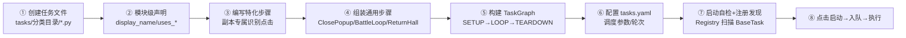

# 构建新任务步骤（按设计书）

> 依据：`任务设计指导书 v1.0`（老程序/脚本实现）+ `04-任务执行引擎` / `13-任务文件管理` / `14-执行器模块` 模块说明书
> 一个游戏任务 = **通用部分**（调度配置 + 战斗前准备 + 战斗后返回）+ **特化部分**（副本专属识别点击）

---

## 〇、总体流程



设计书的三阶段模型（**循环是 BattleLoop 步骤内部的事，TaskGraph 只做线性编排**）：

```
SETUP(1次)   关弹窗 → 进副本 → 调整阵容 → 设御魂
   ↓
LOOP(N次)    检查体力 → 发起战斗 → 等待结算 → 领奖   ← BattleLoop(times=N) 内部循环
   ↓
TEARDOWN(1次) 返回庭院 / 错误恢复
```

---

## 一、适配状态：设计书 vs 代码的差异（✅ 已全部修复）

> 2026-07-31 已按设计书完成代码适配，以下差异均已修复，**设计书写法与标准写法都能跑通**。

| # | 差异 | 修复方式 | 状态 |
|:-:|------|---------|:--:|
| 1 | 入口类基类 | `tasks/registry.py` 兼容 **BaseTask 子类** 和 **声明了 `display_name` 的 TaskStep 子类**（特化步骤无 display_name 不注册） | ✅ |
| 2 | TaskStep 构造 | `tasks/base/task_step.py`：`step_id` 可省略，自动继承类属性 `name/is_generic/timeout`；`StepResult.success("...")` 类级构造工厂可用 | ✅ |
| 3 | tasks.yaml 结构 | `config_schema.TaskEntry` 补全 `repeat/execution_mode/time_slots/max_daily/time_start/time_end/team_id/floor/display_name/max_fail_streak/active_range` | ✅ |
| 4 | task_config 注入 | `run_controller._execute_task_once()` 从 `Scheduler.get_config()` 注入 `context.task_config`（含 `loop_count/floor/team_id/execution_mode/time_slots` 等） | ✅ |
| 5 | 执行模式 | `Scheduler.mark_done()` 按 `execution_mode` 推进：`daily`（按天执行一次）→ 次日首个时段；`per_slot`（按时间段）→ 下一时段起点（配合 `max_daily` 限每日次数） | ✅ |
| 6 | 启动执行 | `repeat.type=on_enter`：05 `load_state()` 启动时重置 next_run=now，填充线程按 `priority=0` 优先入队，执行一次后本轮完成 | ✅ |
| 6b | 特殊条件触发 | `repeat.type=trigger` + `trigger_templates`（识别列表）：无时间配置、无初始 next_run；TriggerWatcher 识图命中或 UI"手动触发"（`update_next_run(name, now)`）→ 入队执行；完成后进已失效"等待下次触发" | ✅ |
| 7 | 任务事件 | TaskStep 入口类由 run_controller 补发 `TASK_STARTED/COMPLETED/FAILED`，UI 队列/历史正常更新 | ✅ |

> 验证：`tools/verify_task_chain.py`（22 项）+ `tools/verify_no_assets.py`（40 项）+ `tools/smoke_mock.py` 全部通过。

---

## 二、一步步实现一个游戏任务（以"御魂副本"为例）

### Step 1 — 准备素材（按《素材体系设计指导》）

素材是任务的"眼睛"。命名规范 `{分区}/{类型}-{名称}.png`：

```
assets/
├── 主界面/按钮-探索入口.png      ← 点击探索
├── 探索/按钮-御魂入口.png        ← 点击御魂副本
├── 探索/按钮-八岐大蛇.png        ← 选择副本
├── 探索/按钮-第十层.png          ← 选择层数
├── 战斗/按钮-挑战.png            ← 发起战斗
├── 战斗/标志-胜利.png            ← 识别胜利
├── 战斗/标志-失败.png            ← 识别失败
├── 战斗/按钮-结算确认.png        ← 结算
├── 通用/按钮-关闭.png            ← 关弹窗
└── 通用/按钮-确定.png            ← 确认
```

代码中引用 = 去 `.png`、`/` 分隔的相对路径，如 `"探索/按钮-八岐大蛇"`。
（模拟模式 + 无真实素材时，合成截图会把 `assets/` 下 PNG 嵌入，识别也能命中；没有素材任务会识别失败——这属正常。）

### Step 2 — 创建任务文件

在分类目录新建 `.py`（注册器扫描 `tasks/daily | event | permanent | special/`，排除 `base/`、`common/`）：

```
tasks/special/orochi_soul.py
```

### Step 3 — 模块级声明（自描述，供 UI 解析）

```python
display_name = "御魂副本-八岐大蛇"
description = "自动刷御魂八岐大蛇第十层，含阵容切换和御魂调整"
task_type = "battle"            # "battle" 或 "event_task"

uses_battle = True              # → UI 显示战斗配置区
uses_team = True                # → UI 显示阵容下拉
uses_soul = True                # → UI 显示御魂配置区
uses_stamina = True             # → UI 显示体力门槛
loop_count = 10                 # 每轮循环次数（BattleLoop 内）
timeout = 900                   # 任务总超时（秒）
```

### Step 4 — 编写特化步骤（副本专属逻辑）

每个步骤 = 一个 `TaskStep` 子类，**构造时必须传 `step_id`**：

```python
from tasks.base.task_step import TaskStep, StepResult

class EnterDungeon(TaskStep):
    """进入副本：点击入口 → 选副本 → 选层数 → 确认"""
    is_generic = False          # 特化模块
    timeout = 30

    def __init__(self):
        super().__init__("enter_dungeon")

    def execute(self, context):
        exe = context.executor
        if not exe.click_image("探索/按钮-御魂入口", timeout=5):
            return StepResult.fail("未找到御魂入口")
        if not exe.click_image("探索/按钮-八岐大蛇", timeout=5):
            return StepResult.fail("未找到八岐大蛇")
        layer = context.task_config.get("floor", 10)
        if not exe.click_image(f"探索/按钮-第{layer}层", timeout=3):
            return StepResult.fail(f"未找到第{layer}层")
        exe.click_if_exists("通用/按钮-确定")
        return StepResult.success(f"已进入副本第{layer}层")
```

### Step 5 — 组装通用步骤 + 构建 TaskGraph

通用模块（`tasks/common/`）直接复用，**按三阶段编排**：

| 阶段 | 通用模块 | 说明 |
|------|---------|------|
| SETUP | `ClosePopup` | 关弹窗 |
| SETUP | `OpenBottomMenu` / `PreCheckTeam` | 确认主界面 / 战斗前验阵容 |
| LOOP | `CheckStamina` → `SelectTeam` → `BattleLoop(times=N)` → `ClaimReward` | 循环体 |
| TEARDOWN | `ReturnHall` | 返回庭院 |
| 错误分支 | `ErrorReturn` | 失败恢复 |

```python
from tasks.common.close_popup import ClosePopup
from tasks.common.return_hall import ReturnHall
from tasks.common.battle_loop import BattleLoop
from tasks.common.check_stamina import CheckStamina

def build_graph(context):
    g = TaskGraph("orochi_soul")

    # ── SETUP（1次）──
    g.add_step("close_popup", ClosePopup(step_id="close_popup"))
    g.add_step("enter", EnterDungeon())
    g.add_step("pre_check", PreCheckTeam(step_id="pre_check"))

    # ── LOOP（N次，BattleLoop 内部循环）──
    loop_n = context.task_config.get("loop_count", 1)
    g.add_step("stamina", CheckStamina(step_id="stamina"))
    g.add_step("battle", BattleLoop(step_id="battle", max_battles=loop_n))

    # ── TEARDOWN（1次）──
    g.add_step("go_home", ReturnHall(step_id="go_home"))

    # 连线
    g.set_entry("close_popup")
    g.add_edge("close_popup", "enter")
    g.add_edge("enter", "pre_check")
    g.add_edge("pre_check", "stamina")
    g.add_edge("stamina", "battle")
    g.add_edge("battle", "go_home")
    g.set_error_branch("go_home")   # 失败 → 返回庭院恢复
    return g
```

> ⚠️ 组装约束（设计书 §6）：一次性操作（阵容/御魂/进入）放 **SETUP**；循环体只放可重复逻辑。TaskGraph 不支持循环边，循环全靠 `BattleLoop(times=N)` 内部 `for` 实现。

### Step 6 — 入口类（必须继承 `BaseTask`，注册 key = `task_id`）

```python
from tasks.base.base_task import BaseTask

class OrochiSoulTask(BaseTask):
    task_id = "orochi_soul"      # ★ 必须与 tasks.yaml 的 name 一致（registry key）
    category = "special"         # daily | event | permanent | special

    def _build_graph(self):
        # 注意：run_controller 当前未注入 task_config，
        # 适配后此处可用 self._context.task_config
        from tasks.base.task_context import TaskContext
        ctx = self._context or TaskContext(task_id=self.task_id)
        return build_graph(ctx)
```

> `BaseTask.execute()` 默认实现 = `self._build_graph().run(context)` → 返回 `TaskResult`，框架自动发布 `TASK_STARTED/TASK_COMPLETED/TASK_FAILED` 事件并回流 UI。

### Step 7 — 配置 `tasks.yaml`

完整配置（适配后，设计书 §5.1 字段全部生效）：

```yaml
tasks:
  - id: orochi_soul            # 唯一 ID
    name: orochi_soul          # ★ 必须 = 入口类 task_id（registry key）
    display_name: 御魂副本-八岐大蛇
    category: special
    enabled: true
    priority: 5                # 1 最高
    repeat:                    # 设计书 §5.1 重复规则（十种，含 on_enter 启动执行、trigger 特殊条件触发）
      type: daily
      value: 1
    execution_mode:            # 执行模式（替代原 execution_rule 每日轮次）
      daily                     # daily=按天执行一次 / per_slot=每时间段各执行一次
    time_start: "08:00"
    time_end: "23:00"
    # time_slots:              # 多时段（2+ 个时段时优先，每时段各执行一次）
    #   - ["10:00", "12:00"]
    #   - ["12:00", "14:00"]
    max_daily: 50              # 每日硬上限（per_slot 时限制每天最多执行几次）
    team_id: 阵容1              # uses_team=True 时
    floor: 10
```

> 完整支持：`repeat` 十种规则（daily/weekly/monthly_start/interval_days/interval_hours/once/expire_at/special/on_enter/trigger）+ `execution_mode` 执行模式（按天/按时间段）+ `time_slots` 多时段（每个时段各执行一次）。触发式任务（`trigger`）配置 `trigger_templates` 识别列表，无时间字段。

### Step 8 — 验证与运行

```bash
cd 新程序/主程序

# ① 注册发现（应看到 orochi_soul）
.venv/bin/python -c "
from tasks.registry import TaskRegistry
r = TaskRegistry(); r.scan()
print(r.get_all())"

# ② 启动自检：素材齐全则不再告警（放素材或模拟模式）
# ③ 双击 启动UI.command → 点击启动 → 日志：
#    设备连接成功 → 运行已启动 → 任务已入队: orochi_soul → 执行记录
```

---

## 三、完整代码模板（对齐当前代码）

```python
"""御魂副本-八岐大蛇第十层"""
display_name = "御魂副本-八岐大蛇"
description = "自动刷御魂八岐大蛇第十层，含阵容切换和御魂调整"
task_type = "battle"
uses_battle = True
uses_team = True
uses_soul = False
uses_stamina = True
loop_count = 10
timeout = 900

from tasks.base.base_task import BaseTask
from tasks.base.task_step import TaskStep, StepResult
from tasks.base.task_graph import TaskGraph
from tasks.common.close_popup import ClosePopup
from tasks.common.return_hall import ReturnHall
from tasks.common.battle_loop import BattleLoop
from tasks.common.check_stamina import CheckStamina
from tasks.common.select_team import SelectTeam


class EnterDungeon(TaskStep):
    """特化：进入副本"""
    is_generic = False
    timeout = 30

    def __init__(self):
        super().__init__("enter_dungeon")

    def execute(self, context):
        exe = context.executor
        if not exe.click_image("探索/按钮-御魂入口", timeout=5):
            return StepResult.fail("未找到御魂入口")
        if not exe.click_image("探索/按钮-八岐大蛇", timeout=5):
            return StepResult.fail("未找到八岐大蛇")
        layer = context.task_config.get("floor", 10)
        if not exe.click_image(f"探索/按钮-第{layer}层", timeout=3):
            return StepResult.fail(f"未找到第{layer}层")
        exe.click_if_exists("通用/按钮-确定")
        return StepResult.success(f"已进入副本第{layer}层")


def build_graph(context):
    g = TaskGraph("orochi_soul")
    g.add_step("close_popup", ClosePopup(step_id="close_popup"))
    g.add_step("enter", EnterDungeon())
    g.add_step("team", SelectTeam(step_id="team"))
    g.add_step("stamina", CheckStamina(step_id="stamina"))
    g.add_step("battle", BattleLoop(
        step_id="battle",
        max_battles=context.task_config.get("loop_count", 1),
    ))
    g.add_step("go_home", ReturnHall(step_id="go_home"))

    g.set_entry("close_popup")
    g.add_edge("close_popup", "enter")
    g.add_edge("enter", "team")
    g.add_edge("team", "stamina")
    g.add_edge("stamina", "battle")
    g.add_edge("battle", "go_home")
    g.set_error_branch("go_home")
    return g


class OrochiSoulTask(BaseTask):
    task_id = "orochi_soul"
    category = "special"

    def _build_graph(self):
        return build_graph(self._context)
```

---

## 四、检查清单

**代码级**
- [ ] 入口类继承 `BaseTask`，`task_id` 与 `tasks.yaml` 的 `name` 一致
- [ ] 每个 `TaskStep` 构造都传了 `step_id`
- [ ] 模块级声明完整（`display_name/description/task_type` + 按需 `uses_*`）
- [ ] 特化步骤在 SETUP/TEARDOWN，循环体只用 `BattleLoop(times=N)`
- [ ] `loop_count` 从 `context.task_config` 读，不硬编码
- [ ] `click_image` 素材名与 `assets/` 实际文件一一对应

**配置级**
- [ ] `tasks.yaml` 的 `tasks` 列表、`id` 唯一、`enabled: true`
- [ ] `repeat` / `execution_mode` / `time_slots` / `time_start` / `time_end`（适配 `TaskEntry` 后）

**素材级**
- [ ] 图片命名遵循 `{分区}/{类型}-{名称}.png`
- [ ] 分辨率与模拟器一致（默认 1280×720）

**运行级**
- [ ] `TaskRegistry` 能发现该任务（`task_id` 出现）
- [ ] 点击启动 → `任务已入队: orochi_soul` → 执行完成日志

---

## 五、适配完成记录（2026-07-31）

按设计书已完成的代码适配：
1. ✅ `config_schema.TaskEntry` 扩展设计书调度字段
2. ✅ `run_controller._execute_task_once()` 注入 `context.task_config`
3. ✅ `tasks/registry.py` 兼容设计书 TaskStep 入口类
4. ✅ `tasks/base/task_step.py` step_id 可省略 + 类属性继承
5. ✅ `tasks/base/task_result.py` `StepResult.success/fail/retry/skip(...)` 类级构造
6. ✅ `core/scheduler.py` `execution_mode` 执行模式 + `time_slots` 多时段 + `on_enter` 启动任务 + `get_config()`

现在可以直接按本文档「三、完整代码模板」写你的第一个任务文件。
