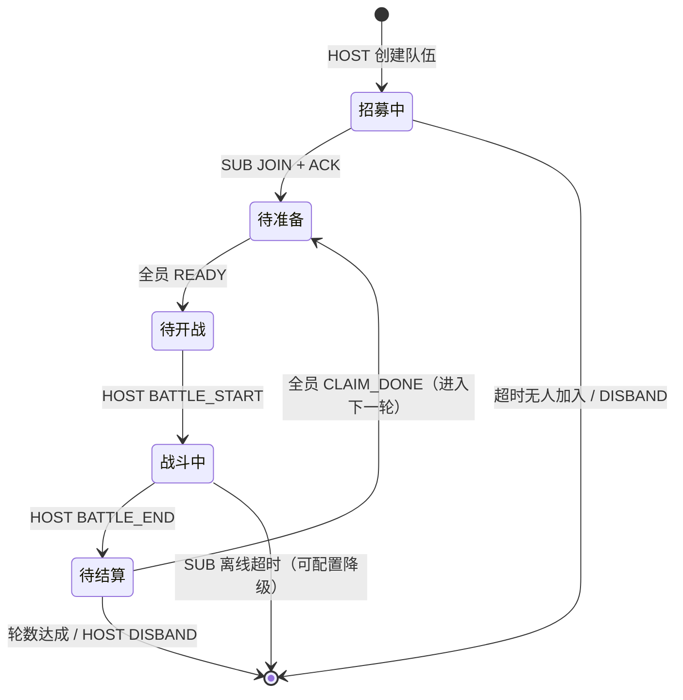

# 组队联动方案设计（大号带小号 · 多窗口协调）

> 设计日期：2026-08-16 ｜ 状态：**方案设计（待确认后实施）**
> 背景：当前每个窗口控制一个模拟器（顶部模拟器下拉），可多开窗口各控各的。
> 需求：大号带小号时，两个窗口的脚本需要**轮流操作**（大号建房→小号进房→
> 双方准备→大号开战→轮流结算→下一轮），实现跨窗口联动。

---

## 一、需求拆解

| # | 需求 | 说明 |
|---|---|---|
| R1 | 窗口互相发现 | 大号窗口创建"队伍"，小号窗口加入同一队伍 |
| R2 | 状态同步 | 每个窗口能看到队友状态（等待/已准备/战斗中/结算中） |
| R3 | 轮流操作 | 按协议顺序交替操作各自模拟器，不抢跑、不死等 |
| R4 | 容错 | 队友窗口关闭/断线/超时 → 可配置降级（继续单人 or 停止） |
| R5 | 与现有体系兼容 | 复用可视化任务节点/示教素材体系；防封间隔各窗口独立生效 |

## 二、两种候选架构

### 方案 A：多窗口进程间协调（推荐）
每个窗口仍是独立进程、独立控制一个模拟器（现状不变），窗口间通过一个
**本地协调中心**交换组队消息。

```
┌──────────────┐          ┌─────────────────────┐          ┌──────────────┐
│ 窗口1（大号） │ ──消息──▶ │   本地协调中心        │ ◀──消息── │ 窗口2（小号） │
│ 模拟器A + 游戏 │ ◀─状态── │ （组队房间/文件邮箱） │ ──状态──▶ │ 模拟器B + 游戏 │
└──────────────┘          └─────────────────────┘          └──────────────┘
```

- ✅ 窗口隔离清晰：一个窗口一个模拟器，现有单窗口逻辑零改动
- ✅ 崩溃隔离：小号窗口崩了不影响大号窗口
- ✅ 天然支持 N 个小号（N+1 个窗口）
- ⚠️ 需要实现协调中心与消息协议（成本可控，见 §四）

### 方案 B：单窗口多设备（老 CoopHost 思路）
一个窗口连接多个模拟器（ConnectionManager 已有设备池雏形），组队任务内部
按账号切换设备轮流操作。

- ✅ 无跨进程通信，状态共享简单（老体系 CoopHost + TEAMING/COORDINATE 事件已有地基）
- ⚠️ 窗口只能同时跑一个脚本，"轮流"内嵌在单个任务里，调试复杂
- ⚠️ 需要多设备连接 UI、账号切换体系大改，与当前"一窗口一模拟器"的心智模型冲突

> **结论：选方案 A**。与用户"多开窗口、窗口间联动"的用法一致，改动面小，
> 老 CoopHost 素材约定可平移复用（btn_accept_invite/btn_ready/btn_start_battle/btn_claim）。

## 三、方案 A 详细设计

### 3.1 本地协调中心：文件邮箱（CoopMailbox）

- 目录：`runtime/coop/{room_id}/`
- 房间由大号窗口创建：`room_id = host_serial 的短哈希 + 时间戳`，展示为**6 位邀请码**
- 消息文件：`msg_{序号:06d}.json`（写入方原子写 `.tmp` → rename，避免半读）
- 每个窗口维护自己已读到的序号，每 300ms 轮询一次新消息（组队对实时性要求低）
- 心跳文件 `heartbeat_{member}.json`（含时间戳 + 状态），超时 30s 视为离线
- 优点：无需端口/权限、跨进程天然可靠、可调试（消息就是文件）、Windows 无依赖

### 3.2 身份与角色

- 成员身份 = `{serial}`（模拟器地址，窗口顶部下拉已确定），显示名 = 账号名
- 角色：`host`（大号，唯一）/ `sub`（小号，可多个）
- 大号窗口操作：「创建队伍」→ 显示邀请码；「解散」；「开始」；结算循环
- 小号窗口操作：「加入队伍」（填邀请码）；「退出」

### 3.3 消息协议（状态机）



| 消息 | 方向 | 载荷 | 语义 |
|---|---|---|---|
| `JOIN` | SUB→HOST | sub_serial | 请求加入 |
| `ACK` | HOST→SUB | members[] | 确认加入 + 当前队员表 |
| `READY` | →HOST | member | 队员已准备（点完准备按钮） |
| `BATTLE_START` | HOST→ALL | round | 大号已点开战，队员切战斗页 |
| `BATTLE_END` | HOST→ALL | round | 战斗结束，进入结算 |
| `CLAIM_DONE` | →HOST | member | 结算领奖完成 |
| `NEXT_ROUND` | HOST→ALL | round | 下一轮（复用 BATTLE_START） |
| `DISBAND` | HOST→ALL | — | 解散 |
| `LEAVE` | →HOST | member | 主动退出 |
| `HEARTBEAT` | →ALL | status | 状态与存活（30s 超时判离线） |

### 3.4 窗口内改动

1. **新模块 `core/coop_mailbox.py`**：房间 CRUD + 消息收发 + 心跳 + 离线检测
   （纯 Python 无 UI 依赖，可直接做跨进程双窗口测试）
2. **SystemBridge 扩展**：`create_room / join_room / leave_room / room_status`，
   窗口身份取当前模拟器下拉 serial
3. **UI 组队面板**（左侧菜单树加「👥 组队联动」）：
   - 大号侧：创建队伍（显示邀请码）/ 成员列表（名称+状态灯）/ 解散
   - 小号侧：输入邀请码加入 / 显示队长状态 / 退出
4. **可视化节点新增「组队」分类（2 个）**：
   - `coop_host`（大号）：参数=轮数/等待超时/素材（创建房间、等待全员准备、
     点开战、等全员结算）——内部即一组 mailbox 收发步骤
   - `coop_sub`（小号）：参数=邀请码/素材（加入房间、接受邀请、准备、
     等开战、结算）
   - 运行时 graph_runner 里这两类节点走 mailbox 状态机，其余与普通节点一致
5. **任务配置**：组队任务在**每个窗口分别保存/启用**（大号窗口启用 coop_host
   任务、小号窗口启用 coop_sub 任务），调度器各自触发，协议保证时序

### 3.5 防封与容错

- 各窗口防封独立（间隔/偏移/轨迹各自随机）→ 天然不会"同步得像机器人"
- 等待队友期间不空转点击：轮询 mailbox + 短 sleep（0.3s），防封计数器不增加
- 队友离线：可配置 `on_partner_offline = disband | solo | hold`（默认 solo）
- 房间垃圾回收：启动时清理超过 1 天的 room 目录

## 四、实施阶段

| 阶段 | 内容 | 验收 |
|---|---|---|
| P0 | `core/coop_mailbox.py` + `tools/verify_coop_mailbox.py`（双进程 fake：建房/加入/READY→START→END 全协议） | 跨进程测试全绿 |
| P1 | SystemBridge + 组队面板（创建/加入/成员状态灯/解散退出） | 双窗口手动可组队、状态可见 |
| P2 | 可视化节点 coop_host / coop_sub + graph_runner 集成 + 素材约定复用 | 真机大号带小号跑通一轮 |
| P3 | 容错策略（离线降级/超时）、房间回收、邀请码有效期 | 断线场景测试 |

## 五、待确认问题

1. 组队素材（接受邀请/准备/开战/结算按钮）是否已在示教素材库中？P2 前需要先示教
2. 队伍规模：只支持 1 大号 + 1 小号，还是支持多个小号？（协议天然支持多小号，UI 可按需）
3. 小号是否固定跟某窗口（即"窗口2 永远是小号A"），还是每次加入时选择？
4. 组队任务的触发方式：双方各自在任务队列里定时触发，还是大号触发后自动通知小号开始？
