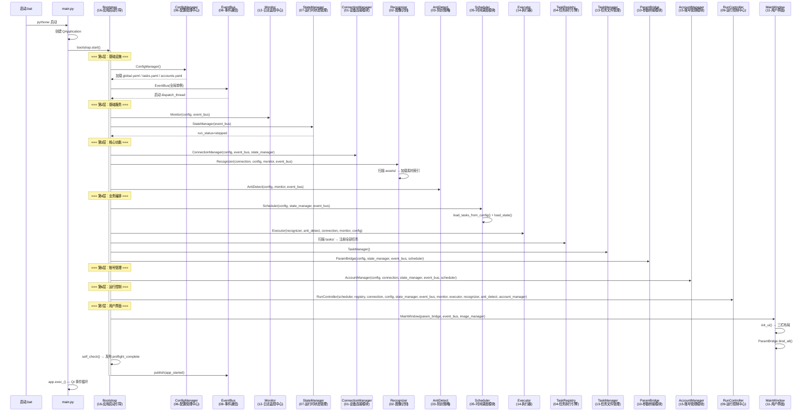
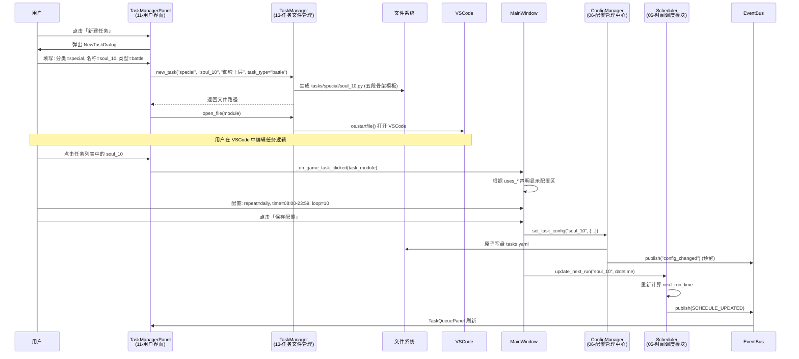
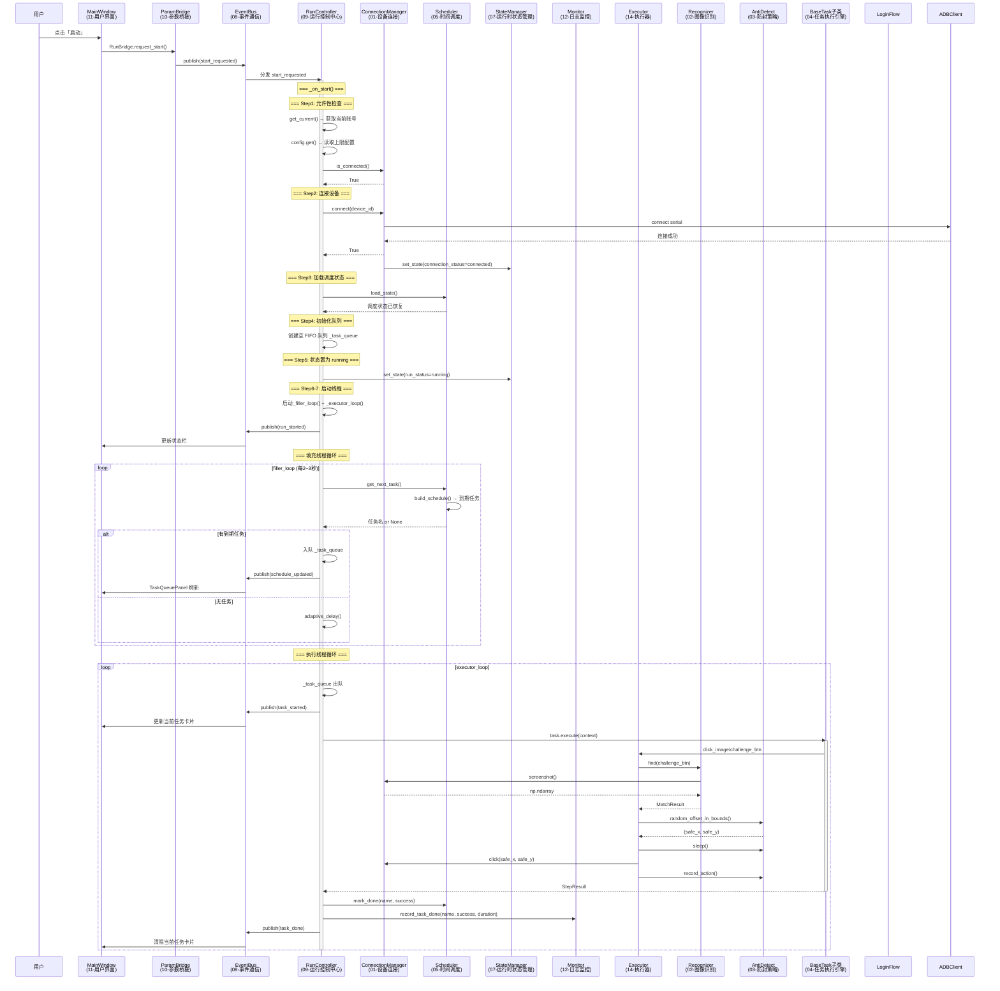
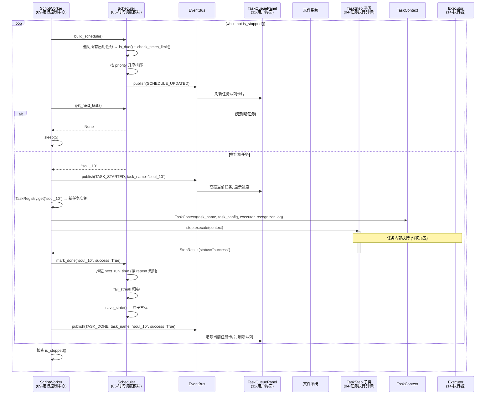
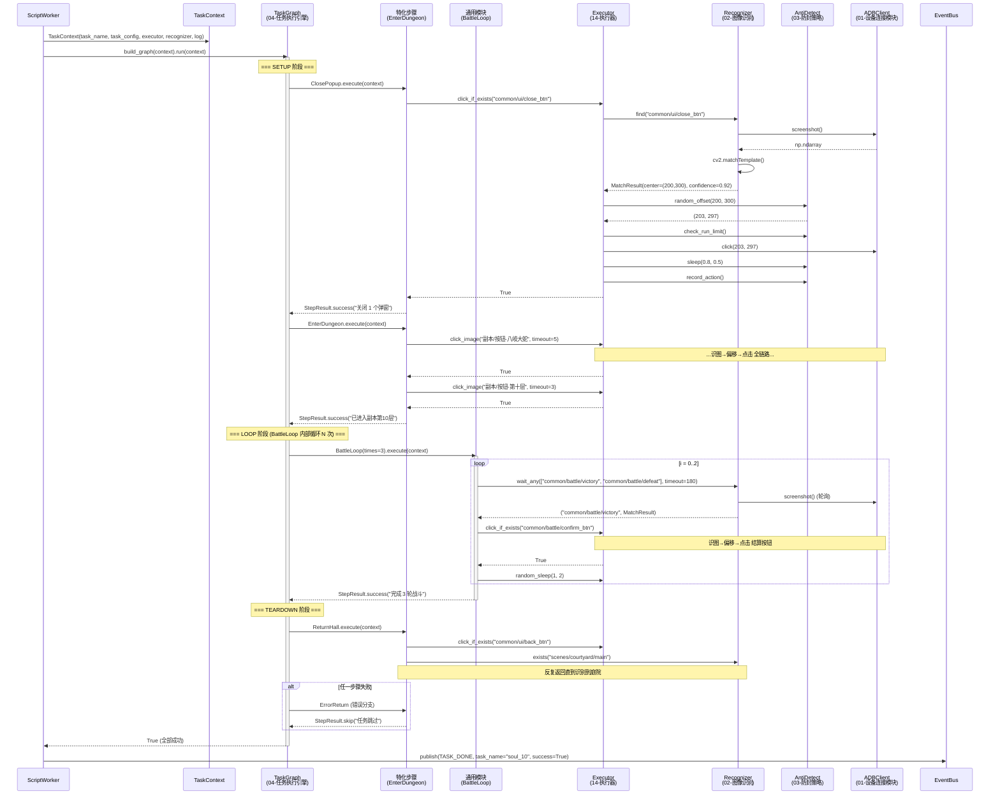
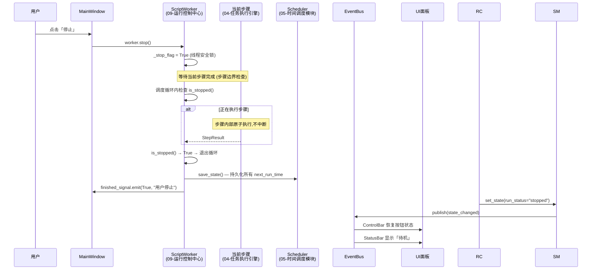
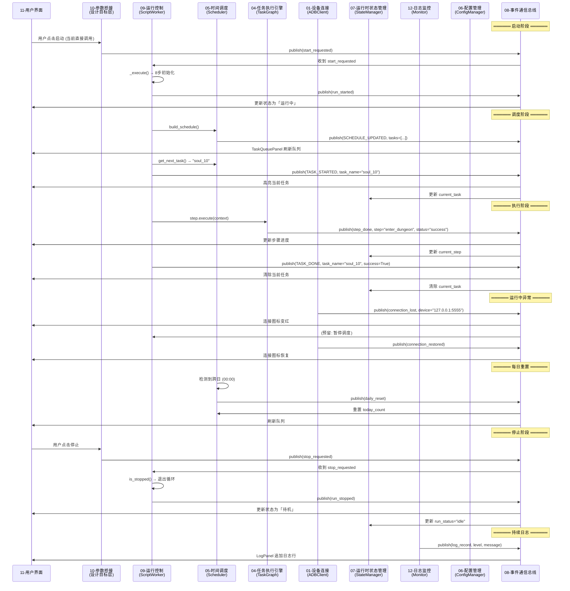
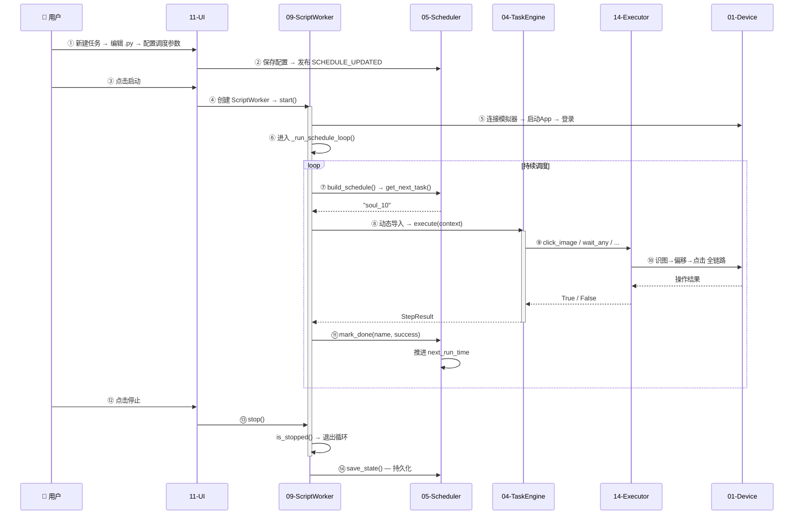

# 模块间交互时序图

> **文档性质**：16 模块完整交互时序  ｜  **版本**：v2.0  ｜  **配套文档**：主程序设计思路 v3.1 / 模块兼容性确认书

---

## 一、系统启动时序



---

## 二、任务创建与配置时序



---

## 三、运行启动 → 执行循环（核心）



---

## 四、调度循环时序（核心）



---

## 五、任务执行内部时序（TaskStep → Executor 全链路）



---

## 六、用户停止时序



---

## 七、事件通信全景



---

## 八、完整生命周期总览



---

## 九、模块间调用关系速查

```
调用层级 (上→下):

11-用户界面 ─── 直接持有 ──→ 06-配置管理
    │                       13-任务文件管理
    │                       素材管理
    │                       05-时间调度
    │
    └── 创建并启动 ──→ 09-运行控制 (ScriptWorker QThread)
                          │
                          ├──→ 05-时间调度 (Scheduler)
                          ├──→ 01-设备连接 (EmulatorManager / ADBClient)
                          ├──→ 02-图像识别 (Recognizer)
                          ├──→ 03-防封策略 (AntiDetect)
                          ├──→ 14-执行器 (Executor)
                          │      ├──→ 02-图像识别
                          │      ├──→ 03-防封策略
                          │      └──→ 01-设备连接
                          ├──→ 04-任务执行引擎 (动态 import → execute)
                          │      ├──→ 14-执行器 (通过 context.executor)
                          │      └──→ 02-图像识别 (通过 context.recognizer)
                          └──→ tasks/login_flow.py (LoginFlow)

08-事件通信总线 ←→ 所有模块 (发布/订阅)
07-运行时状态管理 ←→ 所有模块 (读写共享状态)
12-日志监控中心 ←→ 所有模块 (记录日志)
```

> **注意**：当前实现中 UI (MainWindow) 直接持有核心模块引用，未经过 10-参数桥接。10-参数桥接为设计目标层，计划在未来版本中作为 UI↔逻辑 的唯一通道。
